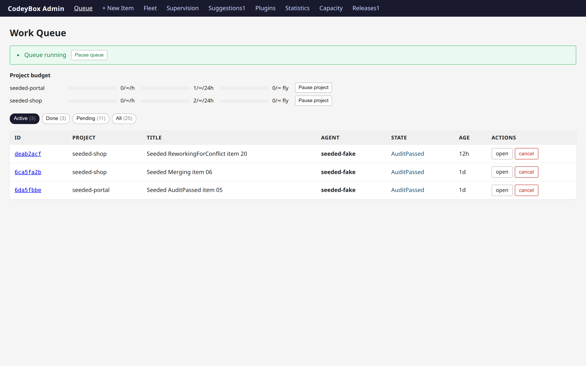
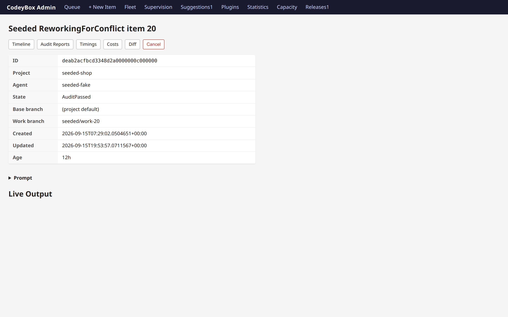
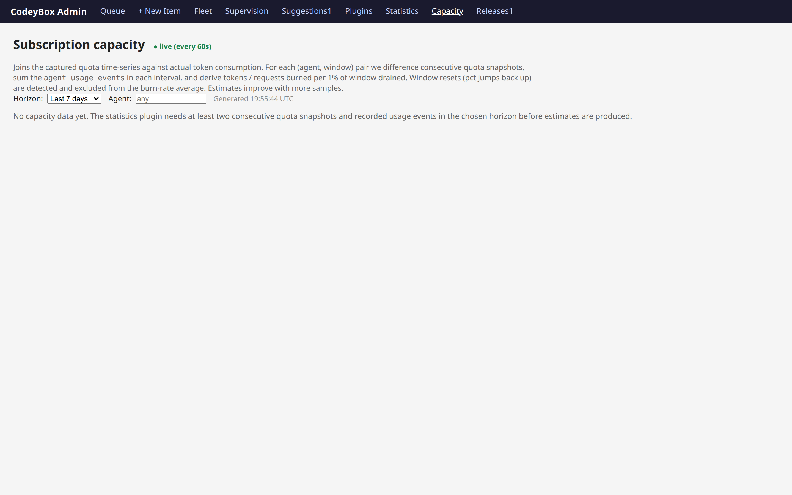
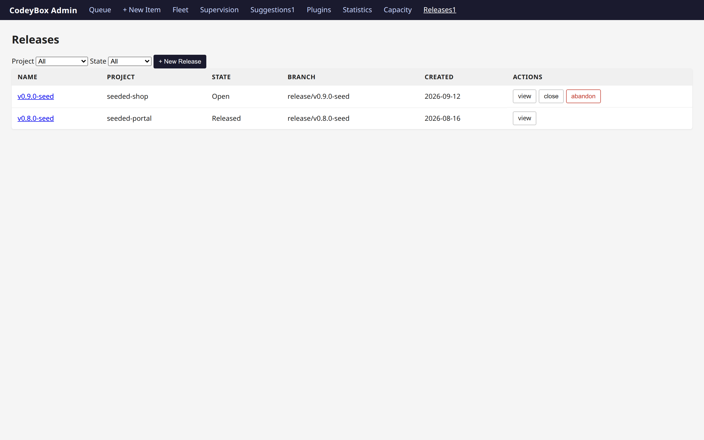
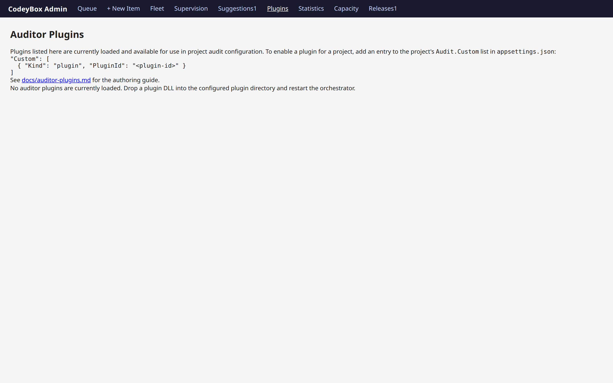
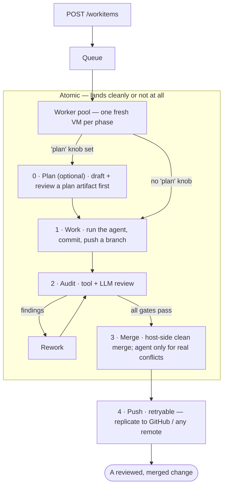

# CodeyBox

**Un orquestador de código autónomo.** Dale una tarea —un título y una indicación
(prompt) sobre uno de tus repositorios— y CodeyBox selecciona un agente de
código, lo ejecuta dentro de una VM efímera, revisa el resultado, resuelve los
conflictos de fusión y aplica el cambio en tu rama (y en GitHub, si lo apuntas
allí). Tú permaneces en el ciclo para las decisiones de producto; él se encarga
de la parte operativa de la entrega.

Controla una *flota* de CLIs de agentes —Claude Code, OpenAI Codex, GitHub
Copilot, Cursor, Gemini, opencode, Antigravity, CrockCode— y enruta cada tarea
al que sea mejor y esté disponible, recurriendo automáticamente a otro
(fallback) cuando un proveedor alcanza un límite de tasa. Ningún agente de
código se ejecuta jamás en tu host: cada llamada al modelo que toca un
repositorio ocurre a través de un CLI de agente dentro de un entorno aislado.

Cada agente está encerrado en una VM real detrás de un firewall impuesto por el
host, porque el objetivo es poder dejarlo en ejecución — consulta
[Seguridad: defensa en profundidad](#seguridad-defensa-en-profundidad).

> Desarrollado en C#/.NET 10. Los repositorios gestionados pueden usar cualquier
> stack —Python, Node, Go, Rust, C# o el tuyo propio— a través de auditores
> impulsados por configuración.



## La interfaz de administración

Todo lo que el orquestador está haciendo es visible y dirigible desde un panel
de administración web en tu host: pausa la cola o un solo proyecto, inspecciona
la cronología de cualquier elemento, sus informes de auditoría, tiempos, costos
y diff, y observa en vivo la salida del agente.

<table>
<tr>
<td width="50%"><br><sub><b>Un elemento, de principio a fin</b> — estado, ramas y pestañas para su cronología, informes de auditoría, tiempos, costos y diff.</sub></td>
<td width="50%"><br><sub><b>Capacidad</b> — cruza las instantáneas de cuota con el consumo real de tokens, para estimar qué compra cada 1 % de una ventana.</sub></td>
</tr>
<tr>
<td><br><sub><b>Releases</b> — agrupa cambios en una rama de versión y haz su seguimiento hasta que se apliquen.</sub></td>
<td><br><sub><b>Plugins</b> — qué está cargado, desde dónde y con qué contribuye cada uno.</sub></td>
</tr>
</table>

Hay más en [`screenshots/`](screenshots). Se generan desde la interfaz real
contra una instancia con datos semilla deterministas; consulta
[`tools/screenshots/`](tools/screenshots) para regenerarlas.

## Por qué podrías querer esto

- **Tienes más trabajo de código que atención de revisión.** Ponlo en cola.
  CodeyBox procesa elementos en paralelo, ejecuta la misma puerta de auditoría
  que aplicaría un revisor humano y solo te molesta cuando realmente necesita
  una decisión.
- **No confías en darle `sudo` a un agente LLM en tu máquina.** Cada agente se
  ejecuta en una VM real con aislamiento de kernel y un firewall impuesto por el
  host: un agente comprometido no puede alcanzar tu host ni exfiltrar datos más
  allá de su lista blanca.
- **Pagas varias suscripciones de código.** CodeyBox las unifica: una sola cola
  de tareas, enrutamiento automático entre agentes, fallback consciente de
  cuotas y seguimiento de costos por agente para que veas a dónde va el dinero.
- **Quieres que sea modificable.** Cada subsistema está detrás de una interfaz;
  añade un agente, un auditor, un forge o un backend de credenciales sin
  bifurcar el proyecto.

## Cómo funciona



Las fases 1 a 3 son atómicas: el cambio se aplica limpiamente o no se aplica en
absoluto. Una fusión limpia es pura fontanería de git en el host
(`git merge-tree` y después `git commit-tree`, sin VM y sin agente) y solo un
conflicto de contenido genuino se entrega a un agente dentro de la VM, para
después verificarse mediante un control de ámbito determinista en el host. El
push es una capa reintentable aparte, de modo que un remoto inestable nunca
corrompe tu resultado local.

La fase opcional de **Planificación** se ejecuta primero cuando un elemento de
trabajo establece el parámetro `plan`: el agente redacta un artefacto de
planificación que los revisores evalúan antes de escribir cualquier código, lo
que compensa el ciclo adicional en cambios grandes o de mayor riesgo. La máquina
de estados completa está en
[`docs/concepts/architecture.md`](docs/concepts/architecture.md).

## Seguridad: defensa en profundidad

La mayoría de los orquestadores de agentes ejecutan el modelo en un contenedor o
directamente en el host. CodeyBox apila varias capas independientes entre un
agente y tu máquina, de modo que un agente inyectado por prompt o activamente
malicioso tiene que vencerlas todas:

- **VMs reales, no contenedores.** Cada agente se ejecuta en una microVM
  respaldada por KVM. Un contenedor comparte el kernel del host: basta un error
  de elevación de privilegios en Linux y el agente está en tu host. Una
  explotación del kernel invitado dentro de una VM no lo está.
- **Egreso impuesto por el host.** El firewall son reglas nftables en el *host*,
  no dentro del invitado. Un agente que obtenga `sudo` en su entorno aislado
  sigue sin poder alcanzar tu LAN, los endpoints de metadatos de la nube ni nada
  fuera de su lista blanca: no puede vaciar un firewall que no puede ver.
- **Credenciales de privilegio mínimo.** Los entornos aislados de las
  herramientas de auditoría no reciben ningún secreto de agente. Tus credenciales
  de upstream/GitHub nunca salen del proceso del orquestador. Un agente inyectado
  no tiene nada que exfiltrar más allá de su propio token acotado.
- **Los agentes de código solo se ejecutan en entornos aislados.** El orquestador
  no realiza ninguna llamada al modelo que entregue un repositorio. Sus propias
  llamadas HTTP son un conjunto fijo y reducido: sondas de cuota y de humo,
  listado de modelos, resumen de changelog y las llamadas deliberadamente solo de
  texto y sin herramientas que se usan para revisar un plan.
- **Un control de fusión determinista.** Las resoluciones de conflictos se
  aceptan mediante una verificación de ámbito en el host, no basada en LLM: las
  líneas cambiadas deben caer dentro de los rangos de conflicto reales, de modo
  que un modelo no puede colar ediciones fuera del conflicto con la excusa de
  "resolverlo".
- **Una puerta de revisión antes de la fusión.** La fase de auditoría ejecuta
  escaneo de secretos, SAST y revisión de seguridad con LLM, lo que detecta toda
  una clase de salidas maliciosas o de baja calidad antes de que se apliquen.

**Salvedad honesta:** esto es defensa en profundidad, no una garantía. Un
adversario determinado —especialmente uno que apunte a un agente de código más
débil que hayas instalado— todavía puede encontrar una ruta, y un perfil de
egreso mal configurado o una configuración de proyecto demasiado amplia debilita
el modelo. Las pruebas de escape del entorno aislado y de evasión del egreso en
un host KVM en vivo siguen pendientes. Lee
[`docs/concepts/security.md`](docs/concepts/security.md) antes de confiarle algo
que importe.

## Inicio rápido

En un host Linux, la vía más rápida —comprueba los prerrequisitos, instala lo que
falte, ofrece configurar el aislamiento de red del host, compila y escribe una
configuración inicial—:

```bash
curl -fsSL https://raw.githubusercontent.com/AdamFrisby/CodeyBox/main/install.sh | bash
```

Es idempotente, pregunta antes de cualquier acción con efectos secundarios y se
niega a continuar en silencio si no se pudo configurar el aislamiento de red del
host. Hace los pasos **1 a 3** por ti e imprime dónde dejó la configuración, así
que cuando termine, ve directamente al **paso 4**.

Como el script llega por stdin, los flags necesitan `bash -s --`:

```bash
curl -fsSL https://raw.githubusercontent.com/AdamFrisby/CodeyBox/main/install.sh | bash -s -- --yes
curl -fsSL https://raw.githubusercontent.com/AdamFrisby/CodeyBox/main/install.sh | bash -s -- --help
```

### Paso a paso

Sigue los cuatro pasos para configurarlo a mano, y en macOS o Windows, donde el
instalador no se ejecuta y solo se admite la topología de ejecutor remoto.

**1. Instala los prerrequisitos** — el [.NET 10 SDK](https://dotnet.microsoft.com/download),
Git, un proveedor de entornos aislados y al menos un CLI de agente autenticado.

**2. Clona y compila.** Usa `./build.sh` en Linux y macOS: primero sana un home
de NuGet no escribible (ver abajo). En Windows usa `./build.ps1`, que reenvía a
`dotnet` con la misma configuración de telemetría.

```bash
git clone https://github.com/AdamFrisby/CodeyBox.git
cd CodeyBox
./build.sh          # Windows: ./build.ps1
```

> **Si la restauración falla con `Failed to read NuGet.Config due to unauthorized access`:**
> Esto también se aplica a `install.sh`, ya que compila de la misma forma. NuGet
> sondea la configuración de nivel de usuario bajo `$HOME/.nuget/NuGet/`
> independientemente de lo que fije el repositorio, así que necesita que ese
> directorio sea escribible. Un home horneado como solo lectura, o propiedad de
> otro usuario, aborta la restauración para cada proyecto, y ni una configuración
> versionada ni `--configfile` ayudan, porque NuGet sondea el directorio de
> configuración de usuario de todos modos.
>
> `./build.sh` se encarga de esto por ti: incorpora (source)
> [`scripts/nuget-home-heal.sh`](scripts/nuget-home-heal.sh), que es la única
> fuente de verdad de la reparación y se comparte con la ruta de auditoría.
> Reubica a un lado un árbol no escribible (sin necesidad de root), preserva la
> caché de paquetes poblada mediante un enlace simbólico para que la restauración
> siga siendo segura sin conexión y siembra una configuración de usuario legible.
> Si no se puede escribir en el propio `$HOME` —un montaje de solo lectura
> heredado, por ejemplo—, ni siquiera es posible mover el árbol a un lado, así
> que en su lugar redirige `DOTNET_CLI_HOME` a un directorio temporal escribible
> para ese árbol de procesos.
>
> ```bash
> ./build.sh                     # builds, healing the NuGet home first if needed
> . scripts/nuget-home-heal.sh   # or just heal the current shell
> ```


**3. Configura un proyecto.** Deja un archivo JSON en algún lugar y apunta
`CODEYBOX_EXTRA_CONFIG` a él (se recarga en caliente al cambiar):

```json
{
  "CodeyBox": {
    "SandboxProvider": "multipass",
    "Projects": [
      {
        "Id": "my-app",
        "RepositoryUrl": "https://github.com/you/my-app.git",
        "BaseBranch": "main",
        "Agent": "claude"
      }
    ]
  }
}
```

**4. Ejecuta:**

```bash
dotnet run --project tools/CodeyBox.Cli -- queue add \
  --project my-app \
  --title "Add a hello file" \
  --prompt "Add hello.txt containing the word hello."
dotnet run --project tools/CodeyBox.Cli -- queue watch WORK_ITEM_ID
```

La versión paso a paso —red del host, una configuración mínima, el primer
elemento de trabajo y qué revisar cuando falla— está en
[`docs/getting-started.md`](docs/getting-started.md).

## Cómo ejecutarlo correctamente

CodeyBox intercambia tiempo real y tokens por profundidad de revisión. El
rendimiento está limitado por la CPU del host y la cuota de los agentes, porque
cada fase concurrente ejecuta una VM. Las tareas pequeñas y dependientes suelen
converger más rápido que los prompts monolíticos.

Ajusta la concurrencia, las clases de agentes, los auditores, los límites de
iteración y los presupuestos a tu carga de trabajo. Observa las transiciones de
estado y las marcas de tiempo de actualización —no solo el conteo de elementos
completados— para distinguir una cola limitada por cuota de una atascada. Los
procedimientos de recuperación están en
[`docs/operating/running.md`](docs/operating/running.md) y
[`docs/operating/recovery.md`](docs/operating/recovery.md).

## Características

- **Flota de agentes con enrutamiento consciente de cuotas.** Agrupa agentes en
  una *clase* con puntuaciones de calidad y límites de concurrencia; CodeyBox
  enruta cada tarea al mejor miembro disponible y **hace fallback en mitad de la
  tarea** cuando uno alcanza un muro de cuota, de modo que el límite de 5 horas
  de un único proveedor nunca detiene la cola.
  → [`docs/concepts/agent-classes.md`](docs/concepts/agent-classes.md)
- **Aislamiento en VM con egreso impuesto por el host.** Cada agente se ejecuta
  en una microVM nueva con credenciales de privilegio mínimo; la política de red
  reside en el host como perfiles nftables que un invitado no puede vaciar.
  → [`docs/operating/host-firewall.md`](docs/operating/host-firewall.md)
- **Puertas de calidad que apilas.** Compón exactamente qué auditores deben pasar
  antes de una fusión —verificaciones de herramientas (formato/compilación/
  pruebas, gitleaks, semgrep) y revisiones con LLM (seguridad, arquitectura,
  calidad, completitud, trampas, pruebas)— y nada se aplica hasta que las
  supere todas.
  → [Puertas de calidad bajo tu control](#puertas-de-calidad-bajo-tu-control)
- **Seguimiento de costos por elemento.** El gasto de tokens de cada elemento de
  trabajo se registra por fase y por agente, así sabes cuánto costó realmente
  ejecutar cada corrección de error o característica.
  → [Conoce el costo de cada cambio](#conoce-el-costo-de-cada-cambio)
- **Resolución agéntica de conflictos.** El agente resuelve los conflictos de
  fusión dentro de su propio entorno aislado a través de su CLI habitual, y luego
  un control de ámbito determinista en el host verifica el resultado antes de
  aceptar el push.
- **Gobernanza de cuotas.** Precios por agente/modelo, presupuestos, alertas y
  una puerta de cuota consciente del ritmo de consumo que enruta esquivando a los
  proveedores agotados.
  → [`docs/operating/quota.md`](docs/operating/quota.md)
- **Durable y reiniciable.** Estado respaldado por SQLite, tolerancia a
  fallos/reinicios, turnos de agente reanudables y reproducción determinista.
  → [`docs/operating/recovery.md`](docs/operating/recovery.md)
- **Tres formas de controlarlo.** Una API REST, un CLI tipado y un panel de
  administración Blazor, además de webhooks salientes firmados con HMAC.
  → [`docs/reference/api.md`](docs/reference/api.md),
  [`docs/reference/webhooks.md`](docs/reference/webhooks.md)
- **Todo es enchufable.** Distribuye auditores, remotos de upstream, proveedores
  de credenciales o backends de entornos aislados personalizados como plugins de
  NuGet, sin bifurcar.
  → [`docs/extending/plugins.md`](docs/extending/plugins.md)

## Puertas de calidad bajo tu control

Los auditores se apilan. Tú eliges exactamente qué verificaciones condicionan una
fusión —auditores de herramientas integrados (formato, compilación, la suite
completa de pruebas, escaneo de secretos con gitleaks, SAST con semgrep) y
revisores LLM sobre seis tipos de auditoría (seguridad, arquitectura, calidad,
completitud, trampas, pruebas)— o traes los tuyos. Cada uno se ejecuta en su
propio entorno aislado acotado por capacidades, y los que solo usan herramientas
no contienen ninguna credencial de agente.

La puerta es estricta: cuando cualquier auditor falla, sus hallazgos vuelven
directamente al agente, que retrabaja y vuelve a enviar; el bucle se repite hasta
que **todas** las puertas pasan o se alcanza el límite de iteraciones, momento en
el que el elemento se marca como `AuditFailed` y *no* se fusiona. El conjunto de
auditores, el umbral de severidad para fallar y el límite de iteraciones son
configuración por proyecto.
→ [`docs/quality/audit.md`](docs/quality/audit.md)

## Conoce el costo de cada cambio

CodeyBox registra **el uso de tokens y el gasto estimado de cada elemento de
trabajo**, desglosado por fase (trabajo, cada retrabajo, cada iteración de
auditoría, fusión) y por agente/modelo. Así puedes responder "¿cuánto costó
realmente ejecutar esta corrección de error?" y formarte una idea real de la
economía del trabajo automatizado antes de escalarlo.

Los costos se normalizan a los precios de lista de pago por API —incluso en
planes de suscripción y teniendo en cuenta los tokens en caché— para que sean
comparables entre agentes y a lo largo del tiempo. Consulta por elemento o por
proyecto:

```bash
curl -H "authorization: Bearer $CODEYBOX_API_KEY" \
  http://localhost:5036/workitems/<id>/costs       # one item, broken out by phase
curl -H "authorization: Bearer $CODEYBOX_API_KEY" \
  http://localhost:5036/projects/my-app/costs      # the whole project
```

La pestaña Costs del panel de administración grafica los mismos datos.
→ [`docs/operating/costs.md`](docs/operating/costs.md)

## Contrólalo desde el CLI

`codeybox` es un cliente tipado para toda la API: se acabó el `curl + jq`.
Ejecútalo desde el código fuente
(`dotnet run --project tools/CodeyBox.Cli -- <command>`) o publica un binario
autocontenido:

```bash
dotnet publish tools/CodeyBox.Cli -c Release -r linux-x64 -o ./bin/codeybox
codeybox configure          # save API URL + token to ~/.config/codeybox
```

Uso cotidiano:

```bash
# Queue a task (inline, --prompt-file, or piped in) and follow it live
ID=$(codeybox queue add --project my-app --title "Add /healthz" \
       --prompt "Add a /healthz endpoint returning 200." --quiet)
codeybox queue watch "$ID"                    # streams state transitions over SSE

codeybox queue ls --state Working,Auditing    # what's in flight
codeybox queue show <id>                      # full detail for one item
codeybox queue retry <id> --from audit        # re-drive a failed item
codeybox queue cancel <id>
```

`queue add` también acepta `--agent`, `--work-branch`, `--base-branch`,
`--auditor-profile`, `--push-upstream` y `--depends-on` (para encadenar elementos
dependientes); `--json` / `--quiet` hacen que cada comando sea apto para
tuberías.
→ [`docs/reference/cli.md`](docs/reference/cli.md)

## La flota de agentes

| Agente         | Añade uno nuevo implementando `IAgentRunner` en…  |
|----------------|--------------------------------------------------|
| Claude Code    | `CodeyBox.Agents.Claude`                         |
| OpenAI Codex   | `CodeyBox.Agents.Codex`                          |
| GitHub Copilot | `CodeyBox.Agents.Copilot`                        |
| Cursor         | `CodeyBox.Agents.Cursor`                         |
| Gemini         | `CodeyBox.Agents.Gemini`                         |
| opencode       | `CodeyBox.Agents.Opencode`                       |
| Antigravity    | `CodeyBox.Agents.Antigravity`                    |
| CrockCode      | `CodeyBox.Agents.Crock`                          |

Los agentes son intercambiables. Una clase lista sus miembros con puntuaciones de
calidad; el enrutador prefiere el de mayor puntuación que esté dentro de su cuota
y por debajo de su límite de concurrencia. Cada fallback queda registrado en el
trailer del commit. Aider, Goose o cualquier otro es simplemente un nuevo
`IAgentRunner`: consulta
[`docs/concepts/agents.md`](docs/concepts/agents.md).

## Compatibilidad de plataformas host

| Host del orquestador | `incus` | `multipass` (local) | `multipass-remote` | `sprites` | `bubblewrap` | `process` (solo desarrollo) |
|---|---|---|---|---|---|---|
| Linux | ✅ impuesto en el host | ✅ impuesto en el host | ✅ impuesto en el ejecutor | ✅ impuesto en el ejecutor | ⚠️ kernel compartido, sin egreso | ⚠️ sin aislamiento, solo desarrollo |
| macOS | ❌ | ❌ | ✅ impuesto en el ejecutor | ✅ impuesto en el ejecutor | ❌ | ❌ |
| Windows | ❌ | ❌ | ✅ impuesto en el ejecutor | ✅ impuesto en el ejecutor | ❌ | ❌ |

Los entornos aislados de VM locales son exclusivos de Linux porque el aislamiento
de egreso se impone en el host mediante nftables sobre puentes Linux por perfil:
no existe un mecanismo equivalente del lado del host en macOS ni en Windows
(evaluado en
[`docs/concepts/host-platforms.md`](docs/concepts/host-platforms.md)). En macOS y
Windows solo se admite la topología de ejecutor remoto: el orquestador se ejecuta
localmente (`./build.sh` en macOS, `./build.ps1` en Windows) mientras las VMs se
ejecutan en un host ejecutor Linux, donde la lista blanca se sostiene. Los
invitados son siempre VMs Linux; ejecutar el orquestador en una plataforma no
implica entornos aislados invitados para ella. Una lista blanca no impuesta nunca
se describe como aislamiento. Las combinaciones de proveedor + host no admitidas
fallan rápido al arrancar con un mensaje que apunta a la matriz.

## Proveedores de entornos aislados

Elige con `CodeyBox.SandboxProvider`:

| Proveedor          | Configuración                          | Aislamiento                                           |
|--------------------|----------------------------------------|-------------------------------------------------------|
| `incus`            | Incus 6.3+ y pool ZFS/Btrfs existente  | KVM; clones base copy-on-write rápidos y eficientes en espacio |
| `multipass`        | `snap install multipass`               | KVM; la configuración más simple                      |
| `multipass-remote` | Multipass en un host remoto + SSH      | KVM, VMs delegadas a otra máquina por SSH: el orquestador permanece local |
| `sprites`          | una cuenta de Fly.io Sprites           | microVMs Firecracker sobre una API HTTP/WebSocket; los montajes escribibles del host se sincronizan de vuelta al desmontar, no en cada exec |
| `bubblewrap`       | `apt install bubblewrap`               | namespaces, kernel compartido; probado por integración |
| `process`          | ninguno                                | **ninguno — solo para pruebas, nunca con prompts no confiables** |

Elige explícitamente: prefiere `incus` para instalaciones headless persistentes o
de alto rendimiento, y `multipass` para la configuración más simple. Los clones
base de Multipass copian imágenes completas de VM; los clones ZFS/Btrfs de Incus
son copy-on-write, lo que reduce el tiempo de arranque, el uso de disco y las
escrituras repetidas en SSD. `multipass-remote` ejecuta las mismas VMs en un host
independiente por SSH mientras el orquestador —estado, git, fusión, auditores—
permanece local, de modo que puedes descargar la CPU de las VMs sin dividir el
cerebro.

Existe una variante **gráfica** (un escritorio más una pantalla VNC/X, y un
puente de uso de computadora que expone capturas de pantalla y síntesis de
entrada a través de la API del entorno aislado), disponible tanto en Incus como
en Multipass. Actívala **por proyecto** con `"GraphicalSandbox": true`, no
seleccionando un proveedor.
→ [`docs/concepts/sandboxes.md`](docs/concepts/sandboxes.md)

## Pasar a producción

1. **Elige el proveedor deliberadamente.** Prefiere Incus para una operación
   headless persistente y de alto rendimiento; usa Multipass para la
   configuración más simple. (Los entornos aislados gráficos no son un factor
   diferenciador: funcionan en ambos). Sigue
   [`docs/concepts/sandboxes.md`](docs/concepts/sandboxes.md), incluidos los
   prerrequisitos de Incus sobre el pool de almacenamiento y la identidad de
   servicio.
2. **Configura el egreso del host** una sola vez, con sudo:
   `scripts/setup-host-networks.sh` crea un puente Linux por perfil de red y
   escribe reglas nftables que descartan todo lo que no esté en la lista blanca
   del perfil. Un agente comprometido con `sudo` no puede deshabilitarlo, porque
   reside en el host, no en el invitado.
   → [`docs/operating/host-firewall.md`](docs/operating/host-firewall.md)
3. **Lee [`docs/concepts/security.md`](docs/concepts/security.md)**: el modelo de
   amenazas, los límites de confianza, los puntos delicados y las brechas
   conocidas. Esto no es opcional.

Las credenciales están escalonadas: los entornos aislados de auditoría que solo
usan herramientas no contienen **ningún** secreto de agente, y las credenciales
del remoto upstream (p. ej., un PAT de GitHub) viven **solo** en el proceso del
orquestador y nunca cruzan a un entorno aislado.

## Procedencia (Provenance)

Cada commit que produce CodeyBox lleva un bloque de trailer, de modo que la
atribución sobrevive incluso a un borrado completo de la base de datos: `git log`
es la fuente de verdad:

```
codeybox: <subject>

CodeyBox-WorkItem: <id>
CodeyBox-Agent: <agent>[/<model>]
CodeyBox-Prompt-Revision: <n>                        # when the revision is known
CodeyBox-Fallbacks: claude→codex (×2 quota); …       # only if fallbacks happened
Co-Authored-By: CodeyBox <noreply@codeybox.invalid>
```

Los commits de correctores mecánicos llevan `CodeyBox-Mechanical-Fixer` en lugar
de `CodeyBox-Agent`, de modo que las normalizaciones deterministas nunca se
atribuyen a un modelo.

## Documentación

[`docs/`](docs/README.md) es la referencia completa, indexada por tarea. Buenos
puntos de entrada:

- [`getting-started.md`](docs/getting-started.md) — de un host limpio a un cambio fusionado
- [`concepts/architecture.md`](docs/concepts/architecture.md) — el sistema, sus límites, la máquina de estados
- [`concepts/security.md`](docs/concepts/security.md) — modelo de amenazas (**léelo antes de desplegar**)
- [`concepts/projects.md`](docs/concepts/projects.md) — configuración de proyecto, auditores y upstream
- [`concepts/agent-classes.md`](docs/concepts/agent-classes.md) — enrutamiento, cuotas y fallback
- [`extending/plugins.md`](docs/extending/plugins.md) — el SDK de plugins
- [`reference/api.md`](docs/reference/api.md) — la referencia REST completa

## Estado

CodeyBox está en desarrollo activo y compila limpiamente con .NET 10. Se
recomienda Incus para despliegues headless persistentes y de alto rendimiento;
Multipass es la opción más simple. El proveedor `process` es solo para pruebas
restringidas y no ofrece aislamiento alguno. Los issues y las contribuciones son
bienvenidos.

Como CodeyBox se construye a sí mismo, su hoja de ruta es su propia cola de
trabajo. Los hilos que se mueven actualmente: terminar el flujo de plan primero
(panel de revisores de planes y verificación de adherencia al plan), selección de
pruebas que ejecute solo las pruebas que un cambio puede afectar, una puerta de
cobertura acotada al diff y atribución de fallos intermitentes, pools de entornos
aislados multi-host, pruebas exploratorias autónomas que emiten artefactos de
regresión reproducibles y una programación más inteligente del drenaje de cuotas.
