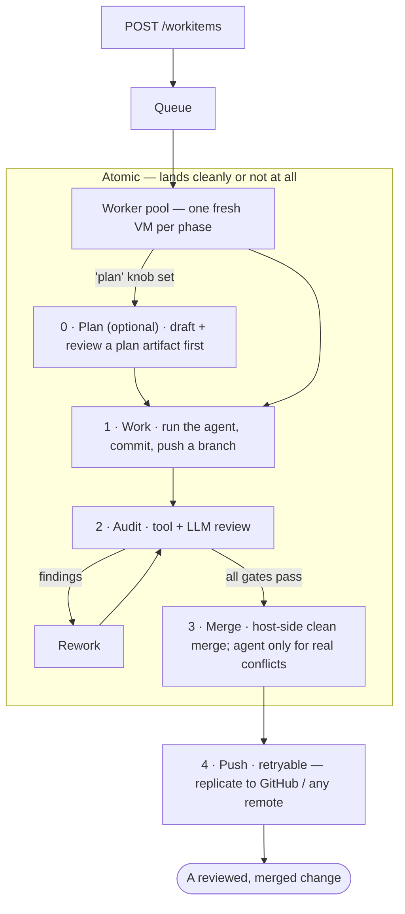

# CodeyBox

**Un orquestador de código autónomo.** Dale una tarea: un título y una indicación (prompt) sobre uno de tus repositorios, y CodeyBox selecciona un agente de código, lo ejecuta dentro de una VM efímera, revisa el resultado, resuelve conflictos de fusión y aplica el cambio en tu rama (y en GitHub, si lo configuras así). Tú permaneces en el ciclo para las decisiones de producto; él se encarga de la parte operativa de entrega.

Controla una *flota* de CLIs de agentes: Claude Code, OpenAI Codex, GitHub Copilot, Cursor, Gemini, opencode, Antigravity y más; y enruta cada tarea al que sea mejor y esté disponible, con falla automática a otro cuando un proveedor alcanza el límite de tasa. El orquestador en sí **no ejecuta LLMs**: programa entornos aislados, controla la calidad, rastrea el gasto y mantiene el estado de manera durable entre reinicios.

Y como cada agente está aislado en una VM real detrás de un firewall impuesto por el host, es uno de los pocos orquestadores de este tipo diseñados para ser **seguros para dejar en ejecución sin supervisión constante** — consulta [Seguridad: defensa en profundidad](#security-defense-in-depth).

> Desarrollado en C#/.NET 10. Los repositorios gestionados pueden usar cualquier stack: Python, Node, Go, Rust, C# o el tuyo propio, a través de auditores impulsados por configuración.

---

## Por qué podrías necesitar esto

- **Tienes más trabajo de código que atención de revisión.** Encólalo en cola. CodeyBox procesa elementos en paralelo, ejecuta la misma puerta de auditoría que usaría un revisor humano y solo te interrumpe cuando realmente necesita una decisión.
- **No confías en que un agente LLM tenga `sudo` en tu máquina.** Cada agente se ejecuta en una VM real con aislamiento de kernel y un firewall impuesto por el host; un agente comprometido no puede alcanzar tu host ni exfiltrar datos más allá de su lista blanca.
- **Pagas varias suscripciones de código.** CodeyBox las unifica en un grupo: una sola cola de tareas, enrutamiento automático entre agentes, falla automática consciente de cuotas y rastreo de costos por agente para que veas a dónde va el dinero.
- **Quieres que sea modificable.** Cada subsistema está detrás de una interfaz; añade un agente, un auditor, un forge o un backend de credenciales sin bifurcar el proyecto.

## Cómo funciona



Una fase de Planificación opcional (0) se ejecuta primero cuando un elemento de trabajo establece el parámetro `plan`: el agente redacta un artefacto de planificación que se revisa antes de escribir cualquier código, útil para cambios más grandes o de mayor riesgo. Las fases 1 a 3 son atómicas: el cambio se aplica correctamente o no se aplica en absoluto. Las fusiones limpias se realizan en el host (sin agente); solo los conflictos reales se asignan a un agente dentro de la VM, y luego se verifican mediante un control de ámbito determinista en el host. El push es una capa separada y reintentable, por lo que un remoto inestable nunca corrompe tu resultado local. La máquina de estados completa está en [`docs/architecture.md`](docs/architecture.md).

## Seguridad: defensa en profundidad

La mayoría de los orquestadores de agentes ejecutan el modelo en un contenedor o directamente en el host. CodeyBox está diseñado para ser **uno de los pocos que puedes dejar funcionando sin supervisión razonablemente**, con varias capas independientes entre un agente y tu máquina, por lo que un agente inyectado por prompt o activamente malicioso debe superar todas ellas, no solo una:

- **VMs reales, no contenedores.** Cada agente se ejecuta en una microVM respaldada por KVM. Un contenedor comparte el kernel del host: con un solo error de elevación de privilegios en Linux, el agente está en tu host. Una explotación del kernel invitado dentro de una VM no lo logra.
- **Egreso impuesto por el host.** El firewall son reglas nftables en el *host*, no dentro del invitado. Un agente que obtenga `sudo` en su entorno aislado sigue sin poder alcanzar tu LAN, puntos finales de metadatos en la nube o nada fuera de su lista blanca; no puede vaciar un firewall que no puede ver.
- **Credenciales de privilegio mínimo.** Los entornos aislados de herramientas de auditoría no reciben secretos de agente en absoluto. Tus credenciales de upstream/GitHub nunca salen del proceso del orquestador. Un agente inyectado no tiene nada que exfiltrar más allá de su propio token de ámbito.
- **Sin HTTP directo al proveedor en el host.** El orquestador nunca realiza llamadas crudas a la API del modelo; todo el trabajo del modelo pasa por los CLIs de los agentes *dentro* de los entornos aislados, por lo que no hay ninguna ruta de solicitud con token que secuestrar en el host.
- **Un control de fusión determinista.** Las resoluciones de conflictos son aceptadas por una verificación de ámbito en el host, no basada en LLM: las líneas cambiadas deben caer dentro de los rangos de conflicto reales, por lo que un modelo no puede colar ediciones fuera del conflicto bajo el disfraz de "resolverlo".
- **Una puerta de revisión antes de la fusión.** La fase de auditoría ejecuta escaneo de secretos, SAST y revisión de seguridad con LLM, detectando una clase de salidas maliciosas o de baja calidad antes de que se apliquen.

**Aclaración honesta:** esta es una defensa en profundidad, no una garantía. Un adversario determinado, especialmente uno que ataque a un agente de código más débil que hayas instalado, aún puede encontrar una ruta, y un perfil de egreso mal configurado o una configuración de proyecto demasiado amplia debilita el modelo. El objetivo es ser significativamente más difícil de abusar que las herramientas comparables, no inquebrantable. Lee [`docs/security.md`](docs/security.md) antes de confiar en él con algo importante.

## Inicio rápido

Instala el [.NET 10 SDK](https://dotnet.microsoft.com/download), Git, un proveedor de entorno aislado compatible y al menos un CLI de agente autenticado. Luego:

```bash
git clone https://github.com/AdamFrisby/CodeyBox.git
cd CodeyBox
dotnet build CodeyBox.slnx
```

Crea una configuración de proyecto con recarga en caliente, establece `CODEYBOX_API_KEY` y `CODEYBOX_EXTRA_CONFIG`, y ejecuta `src/CodeyBox.Api`. Una configuración mínima y la verificación previa completa para producción están en [`SKILL.md`](SKILL.md). Los esquemas completos están en [`docs/projects.md`](docs/projects.md) y [`docs/configuration.md`](docs/configuration.md).

Encola una primera tarea con el CLI:

```bash
dotnet run --project tools/CodeyBox.Cli -- queue add \
  --project my-app \
  --title "Add a hello file" \
  --prompt "Add hello.txt containing the word hello."
dotnet run --project tools/CodeyBox.Cli -- queue watch WORK_ITEM_ID
```

Elige el proveedor de entorno aislado, almacenamiento, política de red, implementación de Admin, estrategia de base y política de upstream deliberadamente antes de producción. Comienza con [`docs/sandbox-providers.md`](docs/sandbox-providers.md), [`docs/security.md`](docs/security.md) y [`docs/operations.md`](docs/operations.md).

## Cómo ejecutarlo correctamente

CodeyBox intercambia tiempo real y tokens por profundidad de revisión. El rendimiento está limitado por la CPU del host y la cuota del agente porque cada fase concurrente ejecuta una VM. Las tareas pequeñas y dependientes generalmente convergen más rápido que los prompts monolíticos.

Ajusta la concurrencia, clases de agentes, auditores, límites de iteración y presupuestos para tu carga de trabajo. Observa las transiciones de estado y los timestamps de actualización, no solo el conteo de elementos completados, para distinguir una cola limitada por cuota de una bloqueada. Los procedimientos de recuperación están en [`docs/operations.md`](docs/operations.md) y [`docs/recovery.md`](docs/recovery.md).

## Características

- **Flota de agentes con enrutamiento consciente de cuotas.** Agrupa agentes en una *clase* con puntuaciones de calidad y límites de concurrencia; CodeyBox enruta cada tarea al mejor miembro disponible y **hace fallback en medio de la tarea** cuando uno alcanza un límite de cuota, por lo que el límite de 5 horas de un único proveedor nunca detiene la cola.
  → [`docs/agent-classes.md`](docs/agent-classes.md)
- **Aislamiento en VM con egreso impuesto por el host.** Cada agente se ejecuta en una microVM nueva con credenciales de privilegio mínimo; la política de red reside en el host como perfiles nftables que un invitado no puede vaciar.
  → [`docs/host-firewall.md`](docs/host-firewall.md)
- **Puertas de calidad que apilas.** Compón exactamente qué auditores deben pasar antes de una fusión: verificaciones de herramientas (formato/construcción/pruebas, gitleaks, semgrep) y revisiones LLM (seguridad, arquitectura, calidad, completitud, anti-engaño) y nada se aplica hasta que pase todas. → [Puertas de calidad bajo tu control](#quality-gates-you-control)
- **Rastreo de costos por elemento.** El gasto de tokens de cada elemento de trabajo se rastrea por fase y agente, para que sepas cuánto costó realmente ejecutar cada corrección de error o característica.
  → [Conoce el costo de cada cambio](#know-what-every-change-costs)
- **Resolución de conflictos por agentes.** El agente resuelve conflictos de fusión dentro de su propio entorno aislado a través de su CLI normal, y luego un control de ámbito determinista en el host verifica el resultado antes de aceptar el push.
- **Gobernanza de cuotas.** Precios por agente/modelo, presupuestos, alertas y una puerta de cuota consciente del ritmo de consumo que enruta alrededor de los proveedores agotados.
  → [`docs/quota-gate.md`](docs/quota-gate.md)
- **Durable y reiniciable.** Estado respaldado por SQLite, tolerancia a fallos/reinicio, resiliencia a suspensión de entornos aislados y reproducción determinista.
  → [`docs/restart-tolerance.md`](docs/restart-tolerance.md)
- **Tres formas de controlarlo.** Una API REST, un CLI tipado y un panel de administración Blazor, además de webhooks salientes firmados con HMAC.
  → [`docs/api.md`](docs/api.md), [`docs/webhooks.md`](docs/webhooks.md)
- **Todo es enchufable.** Distribuye auditores personalizados, remotos de upstream, proveedores de credenciales o backends de entornos aislados como plugins de NuGet, sin bifurcar.
  → [`docs/plugins.md`](docs/plugins.md)

## Puertas de calidad bajo tu control

Los auditores se apilan. Tú eliges exactamente qué verificaciones gatean una fusión: elige entre auditores de herramientas integrados (formato, construcción, suite completa de pruebas, escaneo de secretos gitleaks, SAST semgrep) y revisores LLM (seguridad, arquitectura, calidad, completitud, anti-engaño, cobertura de pruebas), o trae los tuyos. Cada uno se ejecuta en su propio entorno aislado con ámbito de capacidades.

Y la puerta es estricta: cuando cualquier auditor falla, sus hallazgos van directamente de vuelta al agente, que retrabaja y vuelve a enviar; el bucle se repite hasta que **todas** las puertas pasan o alcanza el límite de iteración (en ese punto, el elemento se marca como `AuditFailed` y *no* se fusiona). Nada se aplica hasta que supere la barra que establezcas. El conjunto de auditores, el umbral de severidad de fallo y el límite de iteración son configuraciones por proyecto. → [`docs/audit.md`](docs/audit.md)

## Conoce el costo de cada cambio

CodeyBox rastrea **el uso de tokens y el gasto estimado para cada elemento de trabajo**, desglosado por fase (trabajo, cada retrabajo, cada iteración de auditoría, fusión) y por agente/modelo. Así puedes responder "¿cuánto costó realmente ejecutar esta corrección de error?" y construir una sensación real sobre la economía del trabajo automatizado antes de escalarlo.

Los costos se normalizan a los precios publicados de pago por API, incluso en planes de suscripción y teniendo en cuenta los tokens en caché, para que sean comparables entre agentes y a lo largo del tiempo. Consulta por elemento o por proyecto:

```bash
curl -H "authorization: Bearer $CODEYBOX_API_KEY" \
  http://localhost:5036/workitems/<id>/costs       # un elemento, desglosado por fase
curl -H "authorization: Bearer $CODEYBOX_API_KEY" \
  http://localhost:5036/projects/my-app/costs      # todo el proyecto
```

La pestaña de Costos del panel de administración grafica los mismos datos.
→ [`docs/cost-reporting.md`](docs/cost-reporting.md)

## Controla desde la CLI

`codeybox` es un cliente tipado para toda la API, sin más `curl + jq`. Ejecútalo desde el código fuente (`dotnet run --project tools/CodeyBox.Cli -- <command>`) o publica un binario independiente:

```bash
dotnet publish tools/CodeyBox.Cli -c Release -r linux-x64 -o ./bin/codeybox
codeybox configure          # guarda la URL de API + token en ~/.config/codeybox
```

Uso cotidiano:

```bash
# Encola una tarea (en línea, --prompt-file, o por tubería) y síguela en vivo
ID=$(codeybox queue add --project my-app --title "Add /healthz" \
       --prompt "Add a /healthz endpoint returning 200." --quiet)
codeybox queue watch "$ID"                    # transmite transiciones de estado vía SSE

codeybox queue ls --state Working,Auditing    # qué está en curso
codeybox queue show <id>                       # detalle completo de un elemento
codeybox queue retry <id> --from audit         # vuelve a ejecutar un elemento fallido
codeybox queue cancel <id>
```

`queue add` también acepta `--agent`, `--work-branch`, `--push-upstream` y `--depends-on` (para encadenar elementos dependientes); `--json` / `--quiet` hacen que cada comando sea compatible con tuberías. → [`docs/cli.md`](docs/cli.md)

## La flota de agentes

| Agente          | Añade uno nuevo implementando `IAgentRunner` en… |
|----------------|--------------------------------------------------|
| Claude Code    | `CodeyBox.Agents.Claude`                         |
| OpenAI Codex   | `CodeyBox.Agents.Codex`                          |
| GitHub Copilot | `CodeyBox.Agents.Copilot`                        |
| Cursor         | `CodeyBox.Agents.Cursor`                         |
| Gemini         | `CodeyBox.Agents.Gemini`                         |
| opencode       | `CodeyBox.Agents.Opencode`                       |
| Antigravity    | `CodeyBox.Agents.Antigravity`                    |
| Crock          | `CodeyBox.Agents.Crock`                          |

Los agentes son intercambiables. Una clase lista miembros con puntuaciones de calidad; el enrutador prefiere el que tenga mayor puntuación y esté dentro de la cuota y por debajo de su límite de concurrencia. Cada fallback se registra en el trailer del commit. Aider, Goose o cualquier otra cosa es simplemente un nuevo `IAgentRunner` — consulta [`AGENTS.md`](AGENTS.md).

## Proveedores de entornos aislados

Elige con `CodeyBox.SandboxProvider`:

| Proveedor          | Configuración                              | Aislamiento                                             |
|--------------------|--------------------------------------------|-------------------------------------------------------|
| `incus`            | Incus 6.3+ y pool ZFS/Btrfs existente | Aislamiento KVM; clones base COW rápidos y eficientes en espacio |
| `multipass`        | `snap install multipass`           | Aislamiento KVM; configuración más simple y soporte gráfico   |
| `multipass-remote` | Multipass en un host remoto + SSH   | Aislamiento KVM, VMs delegadas a otra máquina vía SSH; el orquestador permanece local |
| `bubblewrap`       | `apt install bubblewrap`           | namespaces, kernel compartido; probado por integración         |
| `process`          | ninguno                               | **ninguno — solo para pruebas, nunca con prompts no confiables** |

Elige explícitamente: prefiere `incus` para instalaciones headless persistentes o de alto rendimiento, y `multipass` para la configuración más simple o cargas de trabajo gráficas. Los clones base de Multipass copian imágenes completas de VM; los clones ZFS/Btrfs de Incus son copy-on-write, reduciendo el tiempo de arranque, el uso de disco y las escrituras repetidas en SSD. `multipass-remote` ejecuta las mismas VMs en un host separado a través de SSH mientras el orquestador (estado, git, fusión, auditores) permanece local, por lo que puedes descargar la CPU de la VM sin dividir el cerebro.

Un **sabor gráfico** (un escritorio + pantalla VNC/X, más un puente de uso de computadora que expone capturas de pantalla y síntesis de entrada a través de la API del entorno aislado) se superpone a Multipass para proyectos que necesitan una pantalla. Se habilita **por proyecto** con `"GraphicalSandbox": true`, no se selecciona a través de `SandboxProvider`.
Consulta [`docs/sandbox-providers.md`](docs/sandbox-providers.md).

## Pasar a producción

1. **Elige el proveedor deliberadamente.** Prefiere Incus para operación headless persistente y de alto rendimiento; usa Multipass cuando la configuración más simple o los entornos aislados gráficos sean más importantes. Sigue [`docs/sandbox-providers.md`](docs/sandbox-providers.md), incluidos los prerrequisitos de pool de almacenamiento e identidad de servicio de Incus.
2. **Configura el egreso del host** una vez, con sudo: `scripts/setup-host-networks.sh` crea un puente Linux por perfil de red y escribe reglas nftables que descartan todo lo que no esté en la lista blanca del perfil. Un agente comprometido con `sudo` no puede deshabilitar esto porque reside en el host, no en el invitado.
   → [`docs/host-firewall.md`](docs/host-firewall.md)
3. **Lee [`docs/security.md`](docs/security.md)** — el modelo de amenazas, los límites de confianza y los puntos críticos. Esto no es opcional.

Las credenciales están escalonadas: los entornos aislados de auditoría solo para herramientas no contienen **ningún** secreto de agente, y las credenciales remotas de upstream (p. ej., un PAT de GitHub) viven **solo** en el proceso del orquestador y nunca cruzan a un entorno aislado.

## Procedencia (Provenance)

Cada commit que produce CodeyBox lleva un bloque de trailer, por lo que la atribución sobrevive incluso a una eliminación completa de la base de datos — `git log` es la fuente de verdad:

```
codeybox: <subject>

CodeyBox-WorkItem: <id>
CodeyBox-Agent: <agent>[/<model>]
CodeyBox-Fallbacks: claude→codex (×2 quota); …       # solo si ocurrieron fallbacks
Co-Authored-By: CodeyBox <noreply@codeybox.invalid>
```

## Documentación

El árbol [`docs/`](docs/README.md) es la referencia completa. Buenos puntos de entrada:

- [`architecture.md`](docs/architecture.md) — el sistema, puntos de plugin, máquina de estados
- [`security.md`](docs/security.md) — modelo de amenazas (**lee antes de desplegar**)
- [`projects.md`](docs/projects.md) — configuración de proyectos, auditores y upstream
- [`agent-classes.md`](docs/agent-classes.md) — enrutamiento, cuotas y fallback
- [`plugins.md`](docs/plugins.md) — el SDK de Plugins
- [`api.md`](docs/api.md) — la referencia REST completa

## Hoja de ruta

CodeyBox se construye a sí mismo, por lo que su hoja de ruta *es* su propia cola de trabajo. Los hilos más grandes que actualmente se mueven a través de la tubería: una lista viva, no una promesa:

- **Fase de planificación** — un flujo opcional de plan primero (redactar un plan, revisarlo e implementarlo en su contra) se está implementando incrementalmente: la fase y el artefacto de plan almacenado están listos, con un panel de revisores de planes y verificación de adherencia al plan a continuación. → [Cómo funciona](#how-it-works)
- **Ejecutar solo las pruebas que un cambio puede afectar** — selección sólida de pruebas de regresión (grafo de ensamblaje y luego basada en cobertura) que poda la suite para la auditoría por elemento mientras siempre ejecuta todo en la fusión, convirtiendo una ejecución completa de pruebas en segundos para cambios típicos.
- **Puertas de calidad más fuertes y deterministas** — una puerta de cobertura con ámbito de diff, detección de fallos intermitentes que vuelve a ejecutar y *atribuye* fallos fuera del diff en lugar de culpar al cambio, y escaneo de secretos + SAST cableados en cada auditoría.
- **Escalar entre máquinas** — pools de entornos aislados remotos y multi-host con colocación de VM consciente de capacidad, más backends de entornos aislados (p. ej., microVMs Firecracker).
- **Pruebas exploratorias y E2E autónomas** — agentes de modelo económico exploran una capacidad y emiten artefactos de reproducción determinista que se convierten en una suite de regresión; verificación de implementación como una fase de auditoría de primera clase.
- **Gestión de cuotas más inteligente** — un asesor de reinicio que te alerta en el momento óptimo para usar un reinicio de cuota acumulado (y eventualmente lo desencadena), además de un ritmo de drenaje consciente de plazos y una programación más justa en una flota limitada por cuotas.
- **Una flota más amplia y enchufable** — más agentes de código y ejecutores de pruebas como plugins, para que nuevos agentes y lenguajes se integren sin bifurcar.

Bajo todo esto: endurecimiento continuo de la confiabilidad (apagado graceful, robustez de transporte) y descomposición de los componentes internos de la tubería.

## Estado

CodeyBox está en desarrollo activo y compila limpiamente con .NET 10. Incus es recomendado para despliegues headless persistentes y de alto rendimiento; Multipass es la opción más simple y soporta entornos aislados gráficos. El proveedor `process` es solo para pruebas limitadas y no ofrece aislamiento. Los problemas (issues) y contribuciones son bienvenidos.
