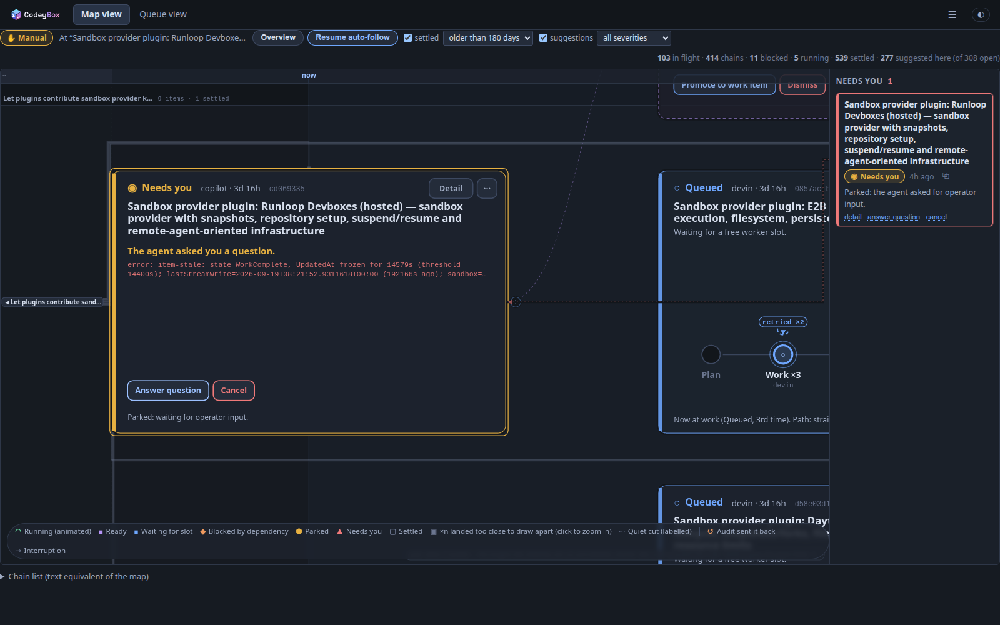
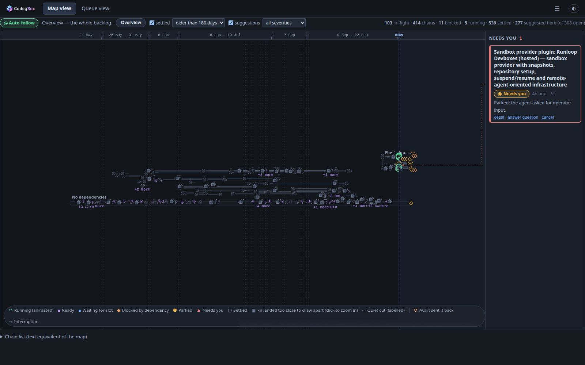
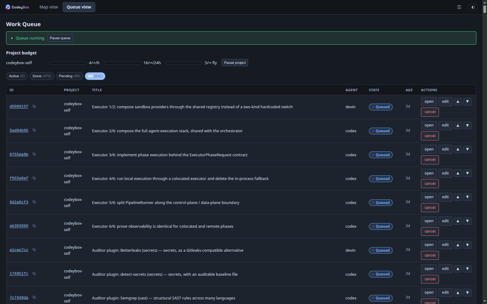
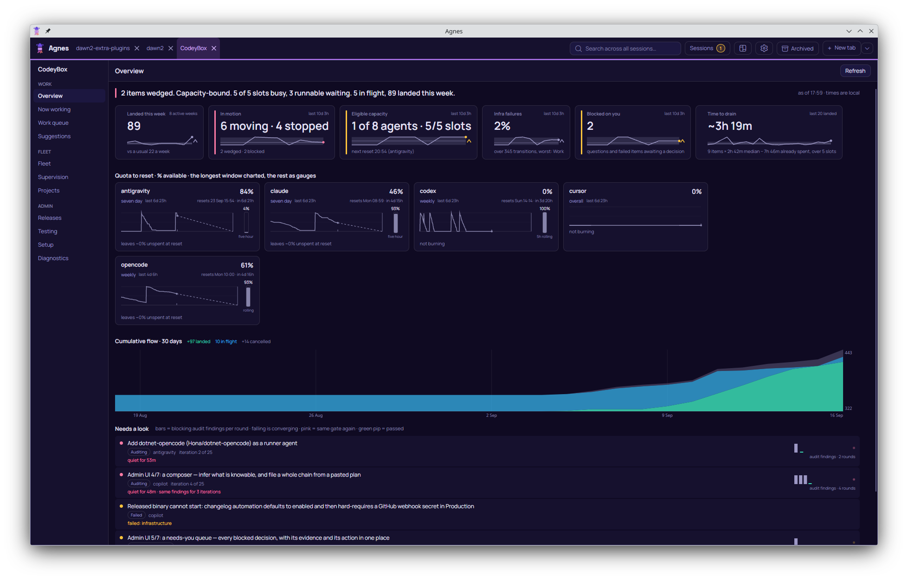
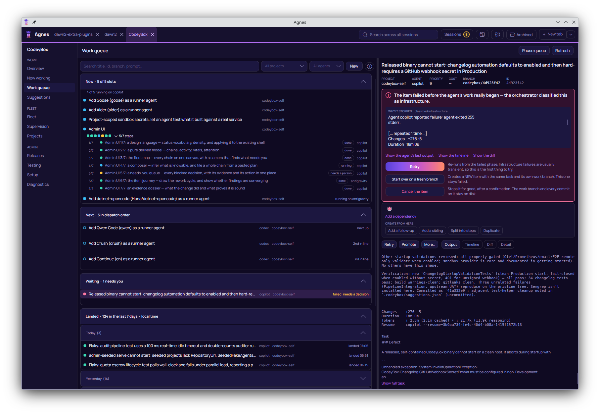
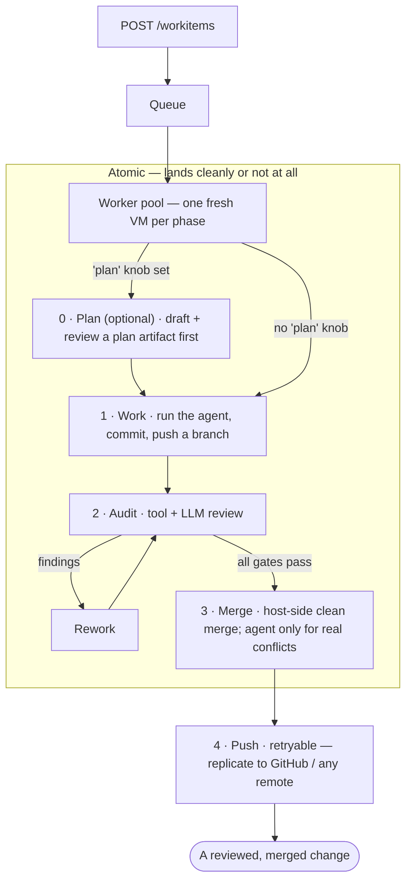

# CodeyBox

**An autonomous coding orchestrator.** Hand it a task — a title and a prompt
against one of your repos — and CodeyBox picks a coding agent, runs it inside a
throwaway VM, reviews the result, resolves merge conflicts, and lands the change
on your branch (and on GitHub, if you point it there). You stay in the loop for
product decisions; it handles the delivery grind.

It drives a *fleet* of agent CLIs — Claude Code, OpenAI Codex, GitHub Copilot,
Cursor, Gemini, opencode, Antigravity, CrockCode — and routes each task to
whichever one is best and available, falling back automatically when a provider
hits a rate limit. No coding agent ever runs on your host: every model call that
touches a repository happens through an agent CLI inside a sandbox.

Every agent is boxed in a real VM behind a host-enforced firewall, because the
point is to be able to leave it running — see
[Security: defense in depth](#security-defense-in-depth).

> Built in C#/.NET 10. Managed repos can be any stack — Python, Node, Go, Rust,
> C#, or your own — through config-driven auditors.



## The admin

CodeyBox ships its own web admin on the host. It is two views of one fleet.

**Map view** is the default. Every chain is on one canvas against a time axis:
landed work to the left, what is running now in the middle, and the queue
forecast to the right. Zoom is semantic — chains at a distance, cards close up,
and an item's full stage pipeline (work, audit as a decision gate, the rework
loop) when you zoom into it. Dead time is compressed rather than scrolled
through, so months of history stay on one screen.

<table>
<tr>
<td width="50%"><br><sub><b>The whole board</b> — four hundred chains and five hundred landed items against a warped time axis, so idle gaps cost pixels instead of scrolling. Zoom out to orient, zoom in on what you found.</sub></td>
<td width="50%"><br><sub><b>Queue view</b> — the same fleet as a list when you want one: filter by state, reorder dispatch, and act on a row without leaving it.</sub></td>
</tr>
</table>

What needs a decision comes to you rather than waiting to be found: an
attention rail pins parked and failed items to the side of the canvas, each
with the actions that actually apply to it — answer the agent's question,
retry from work, retry from audit, delegate a repair turn. Suggestions raised
by agents appear as ghost cards beside the item that produced them, and
promote to real work items in one click.

<table>
<tr>
<td width="50%"><br><sub><b>One item, end to end</b> — state, branches, and tabs for its timeline, audit reports, timings, costs and diff.</sub></td>
<td width="50%"><br><sub><b>Capacity</b> — quota snapshots joined against real token consumption, to estimate what each 1% of a window buys.</sub></td>
</tr>
</table>

Screenshots of the remaining screens are in [`screenshots/`](screenshots); the
page captures are generated against a deterministic seeded instance by
[`tools/screenshots/`](tools/screenshots).

## Want it on your phone? Use Agnes

CodeyBox is an **orchestrator** as well as an application. It exposes a REST
API, a SignalR stream and a typed CLI, and it is designed to be left running
without anyone watching it.

When you want to steer it from another machine or from your phone, use
**[Agnes](https://github.com/AdamFrisby/Agnes)** — a separate product, a remote
interface to coding CLIs, which ships a first-class CodeyBox client. Point it
at your orchestrator and you get the screens below. Neither product requires
the other.

<table>
<tr>
<td width="50%"><br><sub><b>Overview</b> — a plain-language verdict, quota-to-reset per agent, thirty days of cumulative flow, and a "needs a look" list ranked by how stuck something is rather than by age.</sub></td>
<td width="50%"><br><sub><b>Work queue</b> — now, next in dispatch order, waiting on you, and landed. A failed item explains itself and offers the three things you can actually do about it.</sub></td>
</tr>
</table>

## Why you might want this

- **You have more coding work than reviewer attention.** Queue it. CodeyBox
  works items in parallel, runs the same audit gate a human reviewer would, and
  only bothers you when it genuinely needs a decision.
- **You don't trust an LLM agent with `sudo` on your machine.** Every agent runs
  in a real VM with kernel isolation and a host-enforced firewall — a
  compromised agent can't reach your host or exfiltrate past its allowlist.
- **You pay for several coding subscriptions.** CodeyBox pools them: one task
  queue, automatic routing across agents, quota-aware fallback, and per-agent
  cost tracking so you can see where the money goes.
- **You want it to be hackable.** Every subsystem sits behind an interface; add
  an agent, an auditor, a forge, or a credential backend without forking.

## How it works



Phases 1–3 are atomic: the change lands cleanly or not at all. A clean merge is
pure git plumbing on the host — `git merge-tree` then `git commit-tree`, no VM,
no agent — and only a genuine content conflict is handed to an in-VM agent, then
checked by a deterministic host-side scope fence. Push is a separate retryable
tier, so a flaky remote never corrupts your local result.

The optional **Plan** phase runs first when a work item sets the `plan` knob:
the agent drafts a plan artifact that reviewers evaluate before any code is
written, which is worth the extra cycle on larger or higher-risk changes. The
full state machine is in [`docs/concepts/architecture.md`](docs/concepts/architecture.md).

## Security: defense in depth

Most agent orchestrators run the model in a container or straight on the host.
CodeyBox stacks several independent layers between an agent and your machine, so
a prompt-injected or actively malicious agent has to defeat all of them:

- **Real VMs, not containers.** Each agent runs in a KVM-backed microVM. A
  container shares the host kernel — one Linux privilege-escalation bug and the
  agent is on your host. A guest-kernel exploit inside a VM isn't.
- **Host-enforced egress.** The firewall is nftables rules on the *host*, not
  inside the guest. An agent that gains `sudo` in its sandbox still can't reach
  your LAN, cloud-metadata endpoints, or anything off its allowlist — it can't
  flush a firewall it can't see.
- **Least-privilege credentials.** Audit-tool sandboxes get no agent secrets at
  all. Your upstream/GitHub credentials never leave the orchestrator process. An
  injected agent has nothing to exfiltrate beyond its own scoped token.
- **Coding agents run only in sandboxes.** The orchestrator makes no model call
  that hands over a repository. Its own HTTP calls are a fixed, narrow set —
  quota and smoke probes, model listing, changelog summarisation, and the
  deliberately tool-free text-only calls used to review a plan.
- **A deterministic merge fence.** Conflict resolutions are accepted by a
  host-side, non-LLM scope check — changed lines must fall within the actual
  conflict spans — so a model can't smuggle edits outside the conflict under
  cover of "resolving" it.
- **A review gate before merge.** The audit phase runs secret scanning, SAST,
  and LLM security review, catching a class of malicious or low-quality output
  before it ever lands.

**Honest caveat:** this is defense in depth, not a guarantee. A determined
adversary — especially one targeting a weaker coding agent you've installed —
may still find a path, and a misconfigured egress profile or an over-broad
project setup weakens the model. Sandbox-escape and egress-bypass testing on a
live KVM host is still outstanding. Read
[`docs/concepts/security.md`](docs/concepts/security.md) before you trust it with
anything that matters.

## Quickstart

On a Linux host, the fastest path — it checks prerequisites, installs what is
missing, offers to set up host network isolation, builds, and writes a starter
config:

```bash
curl -fsSL https://raw.githubusercontent.com/AdamFrisby/CodeyBox/main/install.sh | bash
```

It is idempotent, prompts before anything with side effects, and refuses to
continue silently if host network isolation could not be set up. It does steps
**1 to 3** for you and prints where it put the config, so when it finishes go
straight to **step 4**.

Because the script arrives on stdin, flags need `bash -s --`:

```bash
curl -fsSL https://raw.githubusercontent.com/AdamFrisby/CodeyBox/main/install.sh | bash -s -- --yes
curl -fsSL https://raw.githubusercontent.com/AdamFrisby/CodeyBox/main/install.sh | bash -s -- --help
```

### Step by step

Follow all four steps to set up by hand. Use them on macOS and Windows too,
where the installer does not run and only the remote-executor topology is
supported.

**1. Install prerequisites** — the [.NET 10 SDK](https://dotnet.microsoft.com/download),
Git, a sandbox provider, and at least one authenticated agent CLI.

**2. Clone and build.** Use `./build.sh` on Linux and macOS — it heals an
unwritable NuGet home first (see below). On Windows use `./build.ps1`, which
forwards to `dotnet` with the same telemetry settings.

```bash
git clone https://github.com/AdamFrisby/CodeyBox.git
cd CodeyBox
./build.sh          # Windows: ./build.ps1
```

> **If restore fails with `Failed to read NuGet.Config due to unauthorized access`:**
> This applies to `install.sh` too, since it builds the same way. NuGet
> probes user-level configuration under `$HOME/.nuget/NuGet/` regardless of what
> the repository pins, so it needs that directory to be writable. A home baked
> read-only, or owned by another user, aborts restore for every project — and a
> checked-in config or `--configfile` does not help, because NuGet probes the
> user settings directory anyway.
>
> `./build.sh` handles this for you: it sources
> [`scripts/nuget-home-heal.sh`](scripts/nuget-home-heal.sh), which is the single
> source of truth for the repair and is shared with the audit path. It relocates
> an unwritable tree aside (no root needed), preserves the populated package
> cache by symlink so restore stays offline-safe, and seeds a readable user
> config. If `$HOME` itself cannot be written to — an inherited read-only mount,
> say — then even moving the tree aside is impossible, so it instead redirects
> `DOTNET_CLI_HOME` to a writable scratch directory for that process tree.
>
> ```bash
> ./build.sh                     # builds, healing the NuGet home first if needed
> . scripts/nuget-home-heal.sh   # or just heal the current shell
> ```


**3. Configure a project.** Drop a JSON file somewhere and point
`CODEYBOX_EXTRA_CONFIG` at it (it hot-reloads on change):

```json
{
  "CodeyBox": {
    "SandboxProvider": "multipass",
    "Projects": [
      {
        "Id": "my-app",
        "RepositoryUrl": "https://github.com/you/my-app.git",
        "BaseBranch": "main",
        "Agent": "claude"
      }
    ]
  }
}
```

**4. Run:**

```bash
dotnet run --project tools/CodeyBox.Cli -- queue add \
  --project my-app \
  --title "Add a hello file" \
  --prompt "Add hello.txt containing the word hello."
dotnet run --project tools/CodeyBox.Cli -- queue watch WORK_ITEM_ID
```

The step-by-step version — host networking, a minimal config, the first work
item, and what to check when it fails — is in
[`docs/getting-started.md`](docs/getting-started.md).

## Running it well

CodeyBox trades wall-clock time and tokens for review depth. Throughput is
bounded by host CPU and agent quota, because each concurrent phase runs a VM.
Small, dependent tasks generally converge faster than monolithic prompts.

Tune concurrency, agent classes, auditors, iteration limits, and budgets for
your workload. Watch state transitions and updated timestamps — not only
completed-item count — to tell a quota-limited queue apart from a stuck one.
Recovery procedures are in
[`docs/operating/running.md`](docs/operating/running.md) and
[`docs/operating/recovery.md`](docs/operating/recovery.md).

## Features

- **Agent fleet with quota-aware routing.** Group agents into a *class* with
  quality scores and concurrency caps; CodeyBox routes each task to the best
  available member and **falls back mid-task** when one hits a quota wall, so a
  single provider's 5-hour limit never stalls the queue.
  → [`docs/concepts/agent-classes.md`](docs/concepts/agent-classes.md)
- **VM isolation with host-enforced egress.** Each agent runs in a fresh microVM
  with least-privilege credentials; network policy lives on the host as nftables
  profiles a guest can't flush.
  → [`docs/operating/host-firewall.md`](docs/operating/host-firewall.md)
- **Quality gates you stack.** Compose exactly which auditors must pass before a
  merge — tool checks (format/build/test, gitleaks, semgrep) and LLM reviews
  (security, architecture, quality, completeness, cheating, tests) — and
  nothing lands until it clears all of them.
  → [Quality gates you control](#quality-gates-you-control)
- **Per-item cost tracking.** Every work item's token spend is tracked by phase
  and agent, so you know what each bugfix or feature actually cost to run.
  → [Know what every change costs](#know-what-every-change-costs)
- **Agentic conflict resolution.** The agent resolves merge conflicts inside its
  own sandbox through its normal CLI, then a deterministic host-side scope fence
  verifies the result before the push is accepted.
- **Quota governance.** Per-agent/per-model pricing, budgets, alerts, and a
  burn-rate-aware quota gate that routes around exhausted providers.
  → [`docs/operating/quota.md`](docs/operating/quota.md)
- **Durable and restartable.** SQLite-backed state, crash/restart tolerance,
  resumable agent turns, and deterministic replay.
  → [`docs/operating/recovery.md`](docs/operating/recovery.md)
- **Four ways to drive it.** A REST API, a SignalR event stream, a typed CLI,
  and the built-in Blazor admin — plus HMAC-signed outbound webhooks, and
  [Agnes](https://github.com/AdamFrisby/Agnes) if you want a remote front end.
  → [`docs/reference/api.md`](docs/reference/api.md),
  [`docs/reference/webhooks.md`](docs/reference/webhooks.md)
- **Pluggable everything.** Ship custom auditors, upstream remotes, credential
  providers, or sandbox backends as NuGet plugins — no fork.
  → [`docs/extending/plugins.md`](docs/extending/plugins.md)

## Quality gates you control

Auditors stack. You choose exactly which checks gate a merge — built-in tool
auditors (formatting, build, the full test suite, gitleaks secret scanning,
semgrep SAST) and LLM reviewers over six audit types (security, architecture,
quality, completeness, cheating, tests) — or bring your own. Each runs in its own
capability-scoped sandbox, and the tool-only ones hold no agent credentials.

The gate is hard: when any auditor fails, its findings go straight back to the
agent, which reworks and resubmits — the loop repeats until **every** gate passes
or it hits the iteration cap, at which point the item is flagged `AuditFailed`
and is *not* merged. The auditor set, the failing-severity threshold, and the
iteration cap are all per-project config.
→ [`docs/quality/audit.md`](docs/quality/audit.md)

## Know what every change costs

CodeyBox tracks **token usage and estimated spend for every work item**, broken
down by phase (work, each rework, each audit iteration, merge) and by
agent/model. So you can answer "what did this bugfix actually cost to run?" — and
build a real feel for the economics of automated work before you scale it up.

Costs are normalised to pay-per-API list prices — even on subscription plans, and
accounting for cached tokens — so they're comparable across agents and over time.
Query per item or per project:

```bash
curl -H "authorization: Bearer $CODEYBOX_API_KEY" \
  http://localhost:5036/workitems/<id>/costs       # one item, broken out by phase
curl -H "authorization: Bearer $CODEYBOX_API_KEY" \
  http://localhost:5036/projects/my-app/costs      # the whole project
```

The admin dashboard's Costs tab charts the same data.
→ [`docs/operating/costs.md`](docs/operating/costs.md)

## Drive it from the CLI

`codeybox` is a typed client for the whole API — no more `curl + jq`. Run it from
source (`dotnet run --project tools/CodeyBox.Cli -- <command>`) or publish a
self-contained binary:

```bash
dotnet publish tools/CodeyBox.Cli -c Release -r linux-x64 -o ./bin/codeybox
codeybox configure          # save API URL + token to ~/.config/codeybox
```

Everyday use:

```bash
# Queue a task (inline, --prompt-file, or piped in) and follow it live
ID=$(codeybox queue add --project my-app --title "Add /healthz" \
       --prompt "Add a /healthz endpoint returning 200." --quiet)
codeybox queue watch "$ID"                    # streams state transitions over SSE

codeybox queue ls --state Working,Auditing    # what's in flight
codeybox queue show <id>                      # full detail for one item
codeybox queue retry <id> --from audit        # re-drive a failed item
codeybox queue cancel <id>
```

`queue add` also takes `--agent`, `--work-branch`, `--base-branch`,
`--auditor-profile`, `--push-upstream`, and `--depends-on` (to chain dependent
items); `--json` / `--quiet` make every command pipe-friendly.
→ [`docs/reference/cli.md`](docs/reference/cli.md)

## The agent fleet

| Agent          | Add a new one by implementing `IAgentRunner` in… |
|----------------|--------------------------------------------------|
| Claude Code    | `CodeyBox.Agents.Claude`                         |
| OpenAI Codex   | `CodeyBox.Agents.Codex`                          |
| GitHub Copilot | `CodeyBox.Agents.Copilot`                        |
| Cursor         | `CodeyBox.Agents.Cursor`                         |
| Gemini         | `CodeyBox.Agents.Gemini`                         |
| opencode       | `CodeyBox.Agents.Opencode`                       |
| Antigravity    | `CodeyBox.Agents.Antigravity`                    |
| CrockCode      | `CodeyBox.Agents.Crock`                          |

Agents are interchangeable. A class lists members with quality scores; the router
prefers the highest-scoring one that's within quota and under its concurrency
cap. Every fallback is recorded in the commit trailer. Aider, Goose, or anything
else is just a new `IAgentRunner` — see
[`docs/concepts/agents.md`](docs/concepts/agents.md).

## Host platform support

| Orchestrator host | `incus` | `multipass` (local) | `multipass-remote` | `sprites` | `bubblewrap` | `process` (dev-only) |
|---|---|---|---|---|---|---|
| Linux | ✅ enforced on host | ✅ enforced on host | ✅ enforced on executor | ✅ enforced on executor | ⚠️ shared kernel, no egress | ⚠️ no isolation, dev only |
| macOS | ❌ | ❌ | ✅ enforced on executor | ✅ enforced on executor | ❌ | ❌ |
| Windows | ❌ | ❌ | ✅ enforced on executor | ✅ enforced on executor | ❌ | ❌ |

Local VM sandboxes are Linux-only because egress isolation is enforced on the
host by nftables on per-profile Linux bridges — there is no equivalent host-side
mechanism on macOS or Windows (assessed in
[`docs/concepts/host-platforms.md`](docs/concepts/host-platforms.md)). On macOS
and Windows only the remote-executor topology is supported: the orchestrator
runs locally (`./build.sh` on macOS, `./build.ps1` on Windows) while VMs execute
on a Linux executor host where the allowlist holds. Guests are always Linux VMs;
running the orchestrator on a platform does not imply guest sandboxes for it.
An unenforced allowlist is never described as isolation. Unsupported provider +
host combinations fail fast at startup with a message pointing at the matrix.

## Sandbox providers

Pick with `CodeyBox.SandboxProvider`:

| Provider           | Setup                                  | Isolation                                             |
|--------------------|----------------------------------------|-------------------------------------------------------|
| `incus`            | Incus 6.3+ and existing ZFS/Btrfs pool | KVM; fast, space-efficient copy-on-write baseline clones |
| `multipass`        | `snap install multipass`               | KVM; simplest setup                                   |
| `multipass-remote` | Multipass on a remote host + SSH       | KVM, VMs offloaded to another machine over SSH — orchestrator stays local |
| `sprites`          | a Fly.io Sprites account               | Firecracker microVMs over an HTTP/WebSocket API; writable host mounts sync back at teardown, not per exec |
| `bubblewrap`       | `apt install bubblewrap`               | namespaces, shared kernel; integration-tested          |
| `process`          | none                                   | **none — testing only, never with untrusted prompts**  |

Choose explicitly: prefer `incus` for persistent or high-throughput headless
installations, and `multipass` for the simplest setup. Multipass baseline clones
copy full VM images; Incus ZFS/Btrfs clones are copy-on-write, reducing launch
time, disk use, and repeated SSD writes. `multipass-remote` runs the same VMs on
a separate host over SSH while the orchestrator — state, git, merge, auditors —
stays local, so you can offload VM CPU without splitting the brain.

A **graphical** flavour (a desktop plus VNC/X display, and a computer-use bridge
exposing screenshots and input synthesis through the sandbox API) is available on
both Incus and Multipass. Turn it on **per project** with
`"GraphicalSandbox": true`, not by selecting a provider.
→ [`docs/concepts/sandboxes.md`](docs/concepts/sandboxes.md)

## Going to production

1. **Choose the provider deliberately.** Prefer Incus for persistent,
   high-throughput headless operation; use Multipass for the simplest setup.
   (Graphical sandboxes are not a differentiator — they work on both.) Follow
   [`docs/concepts/sandboxes.md`](docs/concepts/sandboxes.md), including Incus
   storage-pool and service-identity prerequisites.
2. **Set up host egress** once, with sudo: `scripts/setup-host-networks.sh`
   creates a Linux bridge per network profile and writes nftables rules that drop
   anything not on the profile's allowlist. A compromised agent with `sudo` can't
   disable this, because it lives on the host, not in the guest.
   → [`docs/operating/host-firewall.md`](docs/operating/host-firewall.md)
3. **Read [`docs/concepts/security.md`](docs/concepts/security.md)** — the threat
   model, the trust boundaries, the sharp edges, and the known gaps. This is not
   optional.

Credentials are tiered: tool-only audit sandboxes hold **no** agent secrets, and
upstream remote credentials (e.g. a GitHub PAT) live **only** in the orchestrator
process and never cross into a sandbox.

## Provenance

Every commit CodeyBox produces carries a trailer block, so attribution survives
even a full database wipe — `git log` is the source of truth:

```
codeybox: <subject>

CodeyBox-WorkItem: <id>
CodeyBox-Agent: <agent>[/<model>]
CodeyBox-Prompt-Revision: <n>                        # when the revision is known
CodeyBox-Fallbacks: claude→codex (×2 quota); …       # only if fallbacks happened
Co-Authored-By: CodeyBox <noreply@codeybox.invalid>
```

Mechanical-fixer commits carry `CodeyBox-Mechanical-Fixer` instead of
`CodeyBox-Agent`, so deterministic normalisations are never attributed to a
model.

## Documentation

[`docs/`](docs/README.md) is the full reference, indexed by task. Good entry
points:

- [`getting-started.md`](docs/getting-started.md) — clean host to merged change
- [`concepts/architecture.md`](docs/concepts/architecture.md) — the system, its boundaries, the state machine
- [`concepts/security.md`](docs/concepts/security.md) — threat model (**read before deploying**)
- [`concepts/projects.md`](docs/concepts/projects.md) — project, auditor, and upstream config
- [`concepts/agent-classes.md`](docs/concepts/agent-classes.md) — routing, quotas, and fallback
- [`extending/plugins.md`](docs/extending/plugins.md) — the plugin SDK
- [`reference/api.md`](docs/reference/api.md) — the full REST reference

## Status

CodeyBox is under active development and builds clean against .NET 10. Incus is
recommended for persistent, high-throughput headless deployments; Multipass is
the simpler option. The `process` provider is for constrained testing only and
gives no isolation. Issues and contributions are welcome.

Because CodeyBox builds itself, its roadmap is its own work queue. The threads
currently moving: finishing the plan-first flow (plan-reviewer panel and
plan-adherence checking), test selection that runs only the tests a change can
affect, a diff-scoped coverage gate and flake attribution, multi-host sandbox
pools, autonomous exploratory testing that emits replayable regression
artifacts, and smarter quota drain scheduling.
