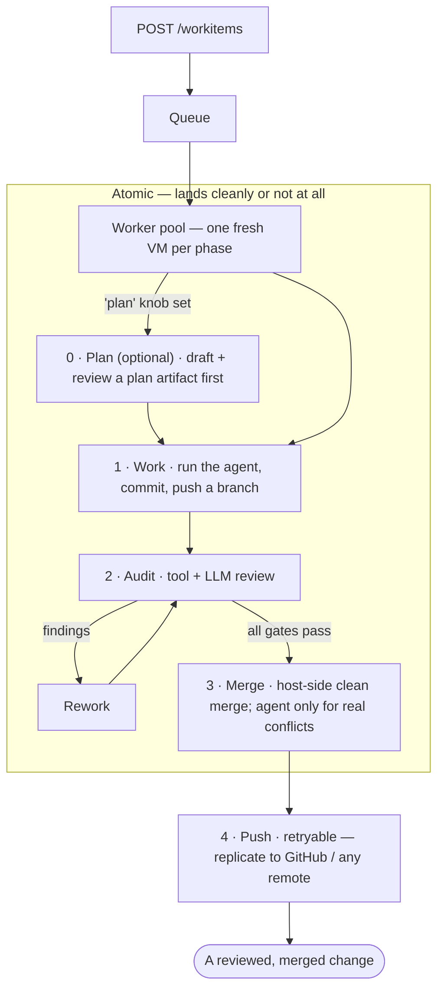
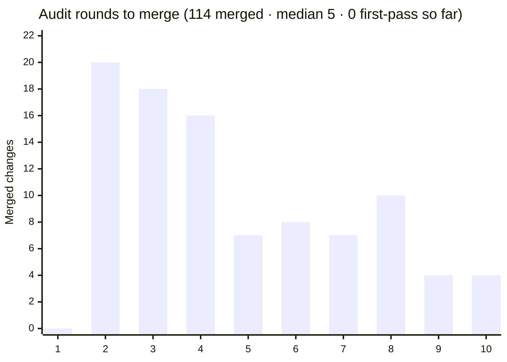
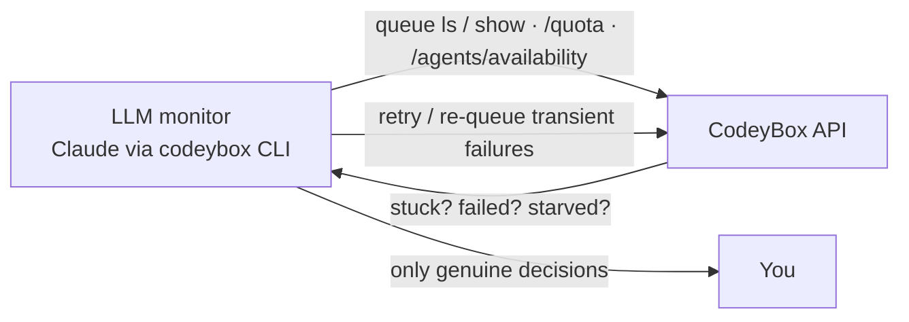

# CodeyBox

**An autonomous coding orchestrator.** Hand it a task — a title and a prompt
against one of your repos — and CodeyBox picks a coding agent, runs it inside
a throwaway VM, reviews the result, resolves merge conflicts, and lands the
change on your branch (and on GitHub, if you point it there). You stay in the
loop for product decisions; it handles the delivery grind.

It drives a *fleet* of agent CLIs — Claude Code, OpenAI Codex, GitHub Copilot,
Cursor, Gemini, opencode, Antigravity, and more — and routes each task to
whichever one is best and available, falling back automatically when a provider
hits a rate limit. The orchestrator itself runs **no LLMs**: it schedules
sandboxes, gates quality, tracks spend, and keeps state durably across restarts.

And because every agent is boxed in a real VM behind a host-enforced firewall,
it's one of the few orchestrators of this kind designed to be **safe to
actually leave running** — see [Security: defense in depth](#security-defense-in-depth).

> Built in C#/.NET 10. Managed repos can be any stack — Python, Node, Go,
> Rust, C#, or your own — through config-driven auditors.

---

## Why you might want this

- **You have more coding work than reviewer attention.** Queue it. CodeyBox
  works items in parallel, runs the same audit gate a human reviewer would,
  and only bothers you when it genuinely needs a decision.
- **You don't trust an LLM agent with `sudo` on your machine.** Every agent
  runs in a real VM with kernel isolation and a host-enforced firewall — a
  compromised agent can't reach your host or exfiltrate past its allowlist.
- **You pay for several coding subscriptions.** CodeyBox pools them: one task
  queue, automatic routing across agents, quota-aware fallback, and per-agent
  cost tracking so you can see where the money goes.
- **You want it to be hackable.** Every subsystem sits behind an interface;
  add an agent, an auditor, a forge, or a credential backend without forking.

## How it works



An optional **Plan** phase (0) runs first when a work item sets the `plan` knob:
the agent drafts a plan artifact that's reviewed before any code is written —
useful for larger or higher-risk changes. Phases 1–3 are atomic — the change lands cleanly or not at all. Clean merges
are done host-side (no agent); only genuine conflicts are handed to an in-VM
agent, then verified by a deterministic host-side scope fence. Push is a
separate retryable tier, so a flaky remote never corrupts your local result.
The full state machine is in [`docs/architecture.md`](docs/architecture.md).

## Security: defense in depth

Most agent orchestrators run the model in a container or straight on the
host. CodeyBox is built to be **one of the few you can reasonably leave
running unattended**, with several independent layers between an agent and
your machine — so a prompt-injected or actively malicious agent has to defeat
all of them, not one:

- **Real VMs, not containers.** Each agent runs in a KVM-backed microVM. A
  container shares the host kernel — one Linux privilege-escalation bug and
  the agent is on your host. A guest-kernel exploit inside a VM isn't.
- **Host-enforced egress.** The firewall is nftables rules on the *host*, not
  inside the guest. An agent that gains `sudo` in its sandbox still can't
  reach your LAN, cloud-metadata endpoints, or anything off its allowlist —
  it can't flush a firewall it can't see.
- **Least-privilege credentials.** Audit-tool sandboxes get no agent secrets
  at all. Your upstream/GitHub credentials never leave the orchestrator
  process. An injected agent has nothing to exfiltrate beyond its own scoped
  token.
- **No host-side provider HTTP.** The orchestrator never makes raw model API
  calls; all model work goes through agent CLIs *inside* sandboxes, so
  there's no token-bearing request path to hijack on the host.
- **A deterministic merge fence.** Conflict resolutions are accepted by a
  host-side, non-LLM scope check — changed lines must fall within the actual
  conflict spans — so a model can't smuggle edits outside the conflict under
  cover of "resolving" it.
- **A review gate before merge.** The audit phase runs secret scanning, SAST,
  and LLM security review, catching a class of malicious or low-quality output
  before it ever lands.

**Honest caveat:** this is defense in depth, not a guarantee. A determined
adversary — especially one targeting a weaker coding agent you've installed —
may still find a path, and a misconfigured egress profile or an over-broad
project setup weakens the model. The goal is to be meaningfully harder to
abuse than comparable tools, not unbreakable. Read
[`docs/security.md`](docs/security.md) before you trust it with anything that
matters.

## Quickstart

The fastest way to watch it work end-to-end, on your own machine:

> Run it on **Multipass** from the start — it's a one-line install
> (`snap install multipass`) and gives you real KVM isolation. A `process`
> provider exists for constrained CI, but it runs the agent **directly on your
> host with no isolation** — never point it at anything untrusted.

**1. Requirements:** the [.NET 10 SDK](https://dotnet.microsoft.com/download),
git, [Multipass](https://multipass.run) (`snap install multipass`), and at
least one agent CLI installed and logged in (e.g. `claude`).

**2. Build:**

```bash
git clone https://github.com/AdamFrisby/CodeyBox.git
cd CodeyBox
dotnet build CodeyBox.slnx
```

> The repository supplies its package sources through `Directory.Build.props`.
> `MSBuild.rsp` supplies the same restore property before a solution restore
> initializes project restore, so package-source selection is repository-local.
> NuGet still initializes the invoking account's profile independently of package
> source selection, so `$HOME/.nuget/NuGet` must exist and be accessible to that
> account. If a container pre-created `$HOME/.nuget` as another user, preserve the
> package cache while replacing only its unwritable parent:
>
> ```bash
> mv "$HOME/.nuget" "$HOME/.nuget.preexisting"
> mkdir -p "$HOME/.nuget/NuGet"
> ln -s "$HOME/.nuget.preexisting/packages" "$HOME/.nuget/packages"
> ```

**3. Configure a project.** Drop a JSON file somewhere and point
`CODEYBOX_EXTRA_CONFIG` at it (it hot-reloads on change):

```json
{
  "CodeyBox": {
    "SandboxProvider": "multipass",
    "Projects": [
      {
        "Id": "my-app",
        "RepositoryUrl": "https://github.com/you/my-app.git",
        "BaseBranch": "main",
        "Agent": "claude"
      }
    ]
  }
}
```

**4. Run:**

```bash
export CODEYBOX_API_KEY=pick-any-bearer-token      # auth for the REST API
export CODEYBOX_CLAUDE_API_KEY=...                 # the agent's own credential
export CODEYBOX_EXTRA_CONFIG=/path/to/your.json
dotnet run --project src/CodeyBox.Api              # http://localhost:5036
```

**5. Queue a task:**

```bash
curl -X POST http://localhost:5036/workitems \
  -H "authorization: Bearer $CODEYBOX_API_KEY" \
  -H 'content-type: application/json' \
  -d '{
    "projectId": "my-app",
    "title": "Add a hello file",
    "prompt": "Add a hello.txt file containing the word hello.",
    "agent": "claude"
  }'
```

Watch it move through the pipeline with the CLI:

```bash
dotnet run --project tools/CodeyBox.Cli -- queue watch <work-item-id>
```

See [`docs/projects.md`](docs/projects.md) for the full project schema
(auditors, per-phase network profiles, upstream config) and
[`docs/configuration.md`](docs/configuration.md) for everything tunable.

## Running it well

CodeyBox trades wall-clock for review depth. A feel for what that means in
practice — with real numbers from running it on its own codebase:

**What to expect.**

- **Features take 2–10 audit rounds to merge (median 5, mean ~7), and in 100+
  merges not one has passed on the first audit** — a worker *could* nail it
  first try; we've just never seen it happen. A long tail reaches 30–40 rounds
  on hard changes. The auditors don't return a complete issue list each pass;
  the multi-round grind *is* the thoroughness. Budget for iteration, not
  one-shot.
- **Throughput is bounded by the lesser of host CPU and agent quota — not raw
  speed.** Each agent is a full VM, so concurrent capacity is first a CPU
  decision. With a single quota-limited subscription workhorse expect a handful
  of merges a day; it climbs as you add parallelism and more agents. Deep in a
  provider's quota tail it can drop to 1–2/day and items park — that's the
  system draining quota, not a fault.
- **Every round costs tokens.** Watch per-item cost early to build a feel for
  the economics before scaling up.

Audit rounds to merge, across 114 merged changes to this codebase — most land
in 2–4 rounds, with a long tail beyond:



_Equal-width, one bar per round; a further **20** changes took **11–41** rounds — the long tail, off-chart._

**Getting good results.**

- **Anchor the fleet with a workhorse** — a strong coding subscription is
  cost-effective for the bulk of the work — but **run in parallel and add
  smaller agents too.** CodeyBox pools them into a class and routes across
  them, so throughput scales with members, not just with one agent's quota.
- **Concurrency is limited by host CPU first, then agent quota.** Because each
  agent runs a real VM, vCPUs are the hard ceiling: **3 concurrent works well
  on modest hardware.** Beefier hosts scale higher — especially on
  **API / pay-per-use pricing**, where you aren't capped by a subscription's
  short rolling-window and can push concurrency up to whatever the host allows.
- **Small, dependent tasks** converge faster and cleaner than monoliths. Chain
  them with `--depends-on`.
- Set your auditor set and iteration cap **deliberately**: hard gates compound
  quality but cost rounds. Config hot-reloads — tune without restart.

**Where it can fail, and how to recover.**

- **Quota exhaustion** → items go `WaitingForQuotaReset` and drain (expected).
  Recover by waiting for the reset or adding capacity.
- **Silent agent failures** (a flaky provider returns "no changes", or a hidden
  429) → the no-changes circuit breaker excludes that agent; retry the affected
  items once it clears.
- **Post-redeploy provisioning regressions** (a bad cloud-init / base-image
  change can fail *every* VM) → after any redeploy, watch the queue for a
  failure flood.
- **Clean shutdowns don't auto-restart** under `Restart=on-failure` — if the
  daemon is down with a clean exit, start it again and check the run log for
  the real reason.
- **Suspend can wedge VMs** on some hosts → use `SandboxTeardownMode=Stop`.
- **Audit non-convergence** → items that hit the iteration cap flag
  `AuditFailed` and are *not* merged; triage or re-queue with
  `codeybox queue retry`.

**Run an LLM monitor over the top.** The orchestrator runs no LLMs itself — but
you can point a capable one (Claude in a terminal, or Claude Code) at the
**`codeybox` CLI** and have it babysit the fleet unattended: periodic health
check-ins that read the queue, retry transient/infrastructure failures,
re-queue starved items, and escalate to you only for genuine decisions.



Give it read access plus scoped `queue retry` / `queue add`, a cadence (e.g.
every few hours), and clear rules on what's routine versus what needs you.
Judge health by **state transitions and `updatedAt` advancing**, not by the
Done count — a quota-throttled queue is slow but healthy; a *wedged* one has
frozen timestamps.

## Features

- **Agent fleet with quota-aware routing.** Group agents into a *class* with
  quality scores and concurrency caps; CodeyBox routes each task to the best
  available member and **falls back mid-task** when one hits a quota wall, so
  a single provider's 5-hour limit never stalls the queue.
  → [`docs/agent-classes.md`](docs/agent-classes.md)
- **VM isolation with host-enforced egress.** Each agent runs in a fresh
  microVM with least-privilege credentials; network policy lives on the host
  as nftables profiles a guest can't flush.
  → [`docs/host-firewall.md`](docs/host-firewall.md)
- **Quality gates you stack.** Compose exactly which auditors must pass before
  a merge — tool checks (format/build/test, gitleaks, semgrep) and LLM reviews
  (security, architecture, quality, completeness, anti-cheating) — and nothing
  lands until it clears all of them. → [Quality gates you control](#quality-gates-you-control)
- **Per-item cost tracking.** Every work item's token spend is tracked by phase
  and agent, so you know what each bugfix or feature actually cost to run.
  → [Know what every change costs](#know-what-every-change-costs)
- **Agentic conflict resolution.** The agent resolves merge conflicts inside
  its own sandbox through its normal CLI, then a deterministic host-side scope
  fence verifies the result before the push is accepted.
- **Quota governance.** Per-agent/per-model pricing, budgets, alerts, and a
  burn-rate-aware quota gate that routes around exhausted providers.
  → [`docs/quota-gate.md`](docs/quota-gate.md)
- **Durable and restartable.** SQLite-backed state, crash/restart tolerance,
  sandbox suspend-resilience, and deterministic replay.
  → [`docs/restart-tolerance.md`](docs/restart-tolerance.md)
- **Three ways to drive it.** A REST API, a typed CLI, and a Blazor admin
  dashboard — plus HMAC-signed outbound webhooks.
  → [`docs/api.md`](docs/api.md), [`docs/webhooks.md`](docs/webhooks.md)
- **Pluggable everything.** Ship custom auditors, upstream remotes, credential
  providers, or sandbox backends as NuGet plugins — no fork.
  → [`docs/plugins.md`](docs/plugins.md)

## Quality gates you control

Auditors stack. You choose exactly which checks gate a merge — pick from
built-in tool auditors (formatting, build, the full test suite, gitleaks
secret scanning, semgrep SAST) and LLM reviewers (security, architecture,
quality, completeness, anti-cheating, test coverage), or bring your own. Each
runs in its own capability-scoped sandbox.

And the gate is hard: when any auditor fails, its findings go straight back to
the agent, which reworks and resubmits — the loop repeats until **every** gate
passes or it hits the iteration cap (at which point the item is flagged
`AuditFailed` and is *not* merged). Nothing lands until it clears the bar you
set. The auditor set, the failing-severity threshold, and the iteration cap
are all per-project config. → [`docs/audit.md`](docs/audit.md)

## Know what every change costs

CodeyBox tracks **token usage and estimated spend for every work item**, broken
down by phase (work, each rework, each audit iteration, merge) and by
agent/model. So you can answer "what did this bugfix actually cost to run?" —
and build a real feel for the economics of automated work before you scale it
up.

Costs are normalised to pay-per-API list prices — even on subscription plans,
and accounting for cached tokens — so they're comparable across agents and
over time. Query per item or per project:

```bash
curl -H "authorization: Bearer $CODEYBOX_API_KEY" \
  http://localhost:5036/workitems/<id>/costs       # one item, broken out by phase
curl -H "authorization: Bearer $CODEYBOX_API_KEY" \
  http://localhost:5036/projects/my-app/costs      # the whole project
```

The admin dashboard's Costs tab charts the same data.
→ [`docs/cost-reporting.md`](docs/cost-reporting.md)

## Drive it from the CLI

`codeybox` is a typed client for the whole API — no more `curl + jq`. Run it
from source (`dotnet run --project tools/CodeyBox.Cli -- <command>`) or publish
a self-contained binary:

```bash
dotnet publish tools/CodeyBox.Cli -c Release -r linux-x64 -o ./bin/codeybox
codeybox configure          # save API URL + token to ~/.config/codeybox
```

Everyday use:

```bash
# Queue a task (inline, --prompt-file, or piped in) and follow it live
ID=$(codeybox queue add --project my-app --title "Add /healthz" \
       --prompt "Add a /healthz endpoint returning 200." --quiet)
codeybox queue watch "$ID"                    # streams state transitions over SSE

codeybox queue ls --state Working,Auditing    # what's in flight
codeybox queue show <id>                       # full detail for one item
codeybox queue retry <id> --from audit         # re-drive a failed item
codeybox queue cancel <id>
```

`queue add` also takes `--agent`, `--work-branch`, `--push-upstream`, and
`--depends-on` (to chain dependent items); `--json` / `--quiet` make every
command pipe-friendly. → [`docs/cli.md`](docs/cli.md)

## The agent fleet

| Agent          | Add a new one by implementing `IAgentRunner` in… |
|----------------|--------------------------------------------------|
| Claude Code    | `CodeyBox.Agents.Claude`                         |
| OpenAI Codex   | `CodeyBox.Agents.Codex`                          |
| GitHub Copilot | `CodeyBox.Agents.Copilot`                        |
| Cursor         | `CodeyBox.Agents.Cursor`                         |
| Gemini         | `CodeyBox.Agents.Gemini`                         |
| opencode       | `CodeyBox.Agents.Opencode`                       |
| Antigravity    | `CodeyBox.Agents.Antigravity`                    |
| Crock          | `CodeyBox.Agents.Crock`                          |

Agents are interchangeable. A class lists members with quality scores; the
router prefers the highest-scoring one that's within quota and under its
concurrency cap. Every fallback is recorded in the commit trailer. Aider,
Goose, or anything else is just a new `IAgentRunner` —
see [`AGENTS.md`](AGENTS.md).

## Sandbox providers

Pick with `CodeyBox.SandboxProvider`:

| Provider           | Setup                              | Isolation                                             |
|--------------------|------------------------------------|-------------------------------------------------------|
| `multipass`        | `snap install multipass`           | **KVM kernel isolation — the recommended default**    |
| `multipass-remote` | Multipass on a remote host + SSH   | KVM isolation, VMs offloaded to another machine over SSH — orchestrator stays local |
| `bubblewrap`       | `apt install bubblewrap`           | namespaces, shared kernel; integration-tested         |
| `process`          | none                               | **none — testing only, never with untrusted prompts** |

`multipass` is the isolation-providing configuration you want for anything real.
`multipass-remote` runs the same VMs on a separate host over SSH while the
orchestrator — state, git, merge, auditors — stays local, so you can offload VM
CPU without splitting the brain.

A **graphical** flavor (a desktop + VNC/X display, plus a computer-use bridge
exposing screenshots and input synthesis through the sandbox API) layers on top
of Multipass for projects that need a display. It's enabled **per project** with
`"GraphicalSandbox": true`, not selected via `SandboxProvider`.
See [`docs/sandbox-providers.md`](docs/sandbox-providers.md).

## Going to production

1. **Use Multipass** (`"SandboxProvider": "multipass"`) — the quickstart already
   does; nothing to change.
2. **Set up host egress** once, with sudo: `scripts/setup-host-networks.sh`
   creates a Linux bridge per network profile and writes nftables rules that
   drop anything not on the profile's allowlist. A compromised agent with
   `sudo` can't disable this because it lives on the host, not in the guest.
   → [`docs/host-firewall.md`](docs/host-firewall.md)
3. **Read [`docs/security.md`](docs/security.md)** — the threat model, the
   trust boundaries, and the sharp edges. This is not optional.

Credentials are tiered: tool-only audit sandboxes hold **no** agent secrets,
and upstream remote credentials (e.g. a GitHub PAT) live **only** in the
orchestrator process and never cross into a sandbox.

## Provenance

Every commit CodeyBox produces carries a trailer block, so attribution
survives even a full database wipe — `git log` is the source of truth:

```
codeybox: <subject>

CodeyBox-WorkItem: <id>
CodeyBox-Agent: <agent>[/<model>]
CodeyBox-Fallbacks: claude→codex (×2 quota); …       # only if fallbacks happened
Co-Authored-By: CodeyBox <noreply@codeybox.invalid>
```

## Documentation

The [`docs/`](docs/README.md) tree is the full reference. Good entry points:

- [`architecture.md`](docs/architecture.md) — the system, plugin points, state machine
- [`security.md`](docs/security.md) — threat model (**read before deploying**)
- [`projects.md`](docs/projects.md) — project, auditor, and upstream config
- [`agent-classes.md`](docs/agent-classes.md) — routing, quotas, and fallback
- [`plugins.md`](docs/plugins.md) — the Plugin SDK
- [`api.md`](docs/api.md) — the full REST reference

## Roadmap

CodeyBox builds itself, so its roadmap *is* its own work queue. The larger
threads currently moving through the pipeline — a living list, not a promise:

- **Planning phase** — an optional plan-first flow (draft a plan, review it,
  then implement against it) is landing incrementally: the phase and stored
  plan artifact are in, with a panel of plan-reviewers and plan-adherence
  checking next. → [How it works](#how-it-works)
- **Run only the tests a change can affect** — sound regression test selection
  (assembly-graph, then coverage-based) that prunes the suite for the per-item
  audit while always running everything on merge — turning a full test run into
  seconds for typical changes.
- **Stronger, deterministic quality gates** — a diff-scoped coverage gate,
  flake detection that re-runs and *attributes* non-diff failures instead of
  blaming the change, and secret-scanning + SAST wired into every audit.
- **Scale across machines** — remote and multi-host sandbox pools with
  capacity-aware VM placement, plus more sandbox backends (e.g. Firecracker
  microVMs).
- **Autonomous exploratory & E2E testing** — cheap-model agents explore a
  capability and emit deterministic replay artifacts that become a regression
  suite; deployment verification as a first-class audit phase.
- **Smarter quota management** — a reset advisor that pings you at the optimal
  moment to spend a banked quota reset (and eventually triggers it), plus
  deadline-aware drain pacing and fairer scheduling across a quota-limited fleet.
- **A broader, pluggable fleet** — more coding agents, and test runners as
  plugins, so new agents and languages slot in without forking.

Underneath it all: continuous reliability hardening (graceful shutdown,
transport robustness) and decomposing the pipeline internals.

## Status

CodeyBox is under active development and builds clean against .NET 10. Multipass
is the recommended, integration-tested, isolation-providing configuration; the
`process` sandbox is for constrained testing only and gives no isolation. Issues
and contributions are welcome.
